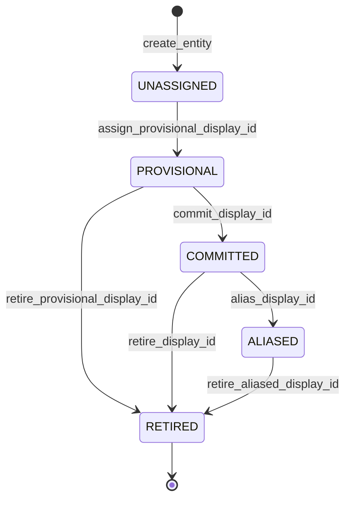
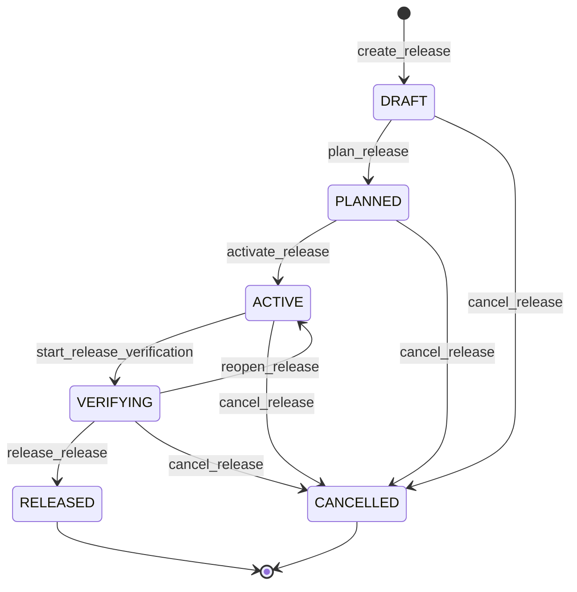
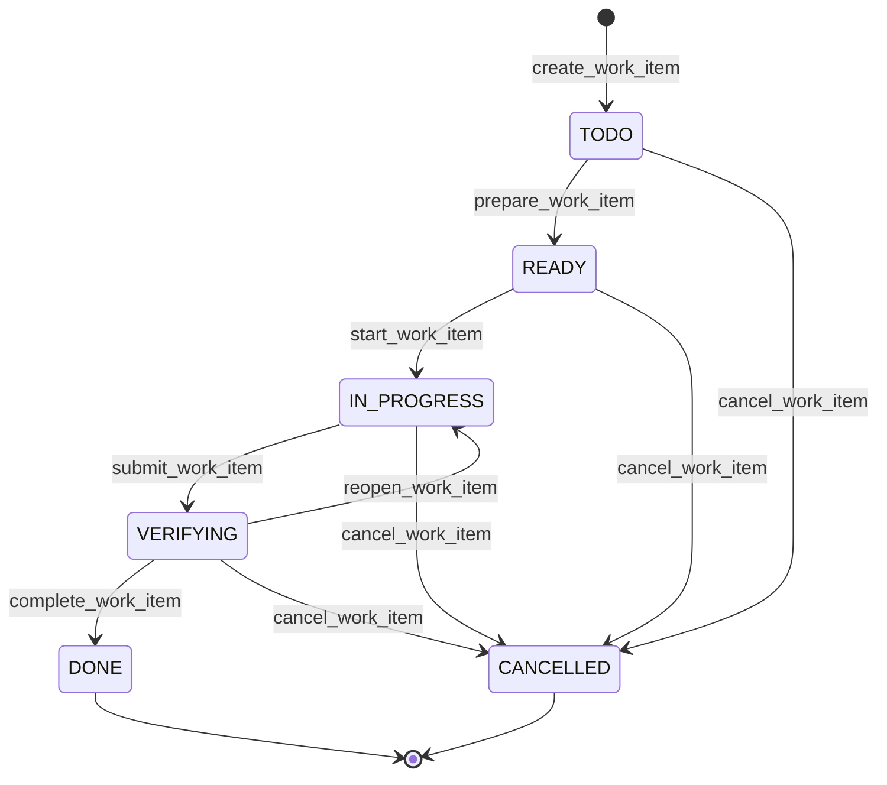

# Arquitectura objetivo

## Principios

1. Release primero: la release es la unidad publica de planificacion, seguimiento, liberacion y cierre.
2. Release Item como valor: user story, capability, defect, enabler, spike, compliance, migration u operational work representan unidades de alcance entregable.
3. Work package por scope: el trabajo tecnico se divide por unidades estables de ownership y validacion, no por "historias hermanas".
4. Scopes globales: los scopes pertenecen al proyecto y las releases referencian revisiones concretas de sus guias.
5. Estado estructurado: YAML o JSON es fuente de verdad; Markdown es proyeccion humana generada.
6. Identidad estable y distribuida: IDs primarios ULID/UUIDv7, `display_id` humano resoluble como alias de entrada y slugs decorativos.
7. Marca reconocible pendiente: v4 deja atras `claude-*` y `plan-*`, pero `ARC Flow` queda como codename hasta cerrar naming gate y namespace real de plugin.
8. Menos comandos publicos: un comando por intencion principal; las variaciones son subcomandos o stages internos.
9. Skills delgadas: la skill coordina intencion, aprobacion y juicio del agente; no implementa mecanica repetible.
10. Runtime determinista: parseo, validacion, escritura atomica, indices, estados, secuencia, locks, journal y comandos planificados viven en scripts/librerias.
11. IA acotada: el agente interpreta producto, descompone trabajo, toma decisiones tecnicas justificadas, implementa codigo y revisa evidencia.
12. Configuracion explicita: policies, lanes, gates, autonomia, comandos permitidos y generadores custom viven en configuracion versionada.
13. Reproducibilidad: cada workspace registra plugin lock, schema, template pack, guide revisions y eventos.

## Modelo de dominio

```text
Project Context
+-- Scope Catalog
|   +-- Scope
|   +-- Task Guide
|   +-- Test Guide
+-- Policies
+-- Decisions
+-- Releases
    +-- Release
        +-- Release Item
            +-- Scope Work Package
            |   +-- Tasks
            +-- Scope Work Package
                +-- Tasks
```

Version corta:

```text
release -> release item -> scope work package -> task
```

## Limites de agregados

El termino "Release Aggregate" no debe implicar atomicidad global sobre todo el arbol. El modelo operativo tiene agregados relacionados:

```text
ProjectContext Aggregate
Scope Aggregate
Release Aggregate
ReleaseItem Aggregate
WorkPackage Aggregate
Task Aggregate
```

Invariantes locales se validan transaccionalmente dentro de un agregado:

- schema valido;
- transicion permitida;
- scope valido;
- estado local;
- campos condicionales;
- gates propios.

Invariantes transversales se calculan o validan mediante queries y policies:

- readiness de Release;
- completion agregada;
- dependencias satisfechas;
- grafo sin ciclos;
- work packages obligatorios completados;
- gates transversales aprobados.

Modelo de consistencia:

```text
strong consistency within aggregate
eventual/recomputed consistency across aggregates
```

Operaciones multiagregado declaran agregados leidos, agregados mutados, revisiones, orden de escritura, compensacion, postcondiciones y riesgo de conflicto.

### Release

La release controla:

- objetivo del incremento;
- alcance comprometido;
- target, lane y politica de entrega;
- release items incluidos;
- gates de release;
- riesgos y blockers agregados;
- eventos de release y deployment;
- evidencia de cierre y finalizacion.

La release no reemplaza deployment ni retrospectiva. Los eventos de deployment y la finalizacion son entidades/eventos diferenciados dentro del agregado de release.

### Release Item

El Release Item es la entidad canonica de alcance dentro de una release. Puede representar trabajo funcional, tecnico, investigativo, operacional o regulatorio.

```yaml
kind: user_story | capability | defect | enabler | spike | compliance | migration | operational
```

Campos condicionales:

| Kind | Campos requeridos |
|------|-------------------|
| `user_story` | actor, need, value, acceptance_criteria |
| `capability` | outcome, behavior, acceptance_criteria |
| `defect` | observed_behavior, expected_behavior, reproduction, severity |
| `enabler` | technical_outcome, unlocked_capabilities |
| `spike` | question, timebox, expected_decision |
| `compliance` | obligation, authority, deadline, evidence |
| `migration` | source_state, target_state, rollback |
| `operational` | procedure, owner, evidence |

Un Release Item funcional puede contener:

- actor;
- necesidad;
- valor;
- comportamiento esperado;
- criterios de aceptacion;
- reglas funcionales;
- outcome;
- Definition of Done funcional;
- work packages requeridos u opcionales.

Un Release Item no se divide artificialmente por componentes tecnicos. Si una capacidad afecta web, API, datos y documentacion, sigue siendo un solo item y contiene cuatro work packages.

### Scope Work Package

Un work package contiene la porcion tecnica o disciplinaria de un Release Item para un scope propietario:

- scope propietario;
- diseno tecnico;
- interfaces;
- contratos;
- dependencias tecnicas;
- riesgos y blockers del scope;
- gates aplicables;
- tasks atomicas;
- evidencia del scope.

Un work package puede representar API, frontend, agents, infraestructura, documentacion, datos, compliance u operacion manual.

### Task

La task es el cambio atomico ejecutable:

- objetivo tecnico;
- archivos esperados;
- precondiciones;
- pasos;
- pruebas;
- evidencia;
- closeout.

Una task pertenece a exactamente un work package y hereda el scope de ese work package.

## Scope

`scope` queda definido como una unidad estable de delivery, ownership y validacion que puede recibir work packages y posee paths, fuentes, reglas y gates propios.

Un scope no es solo una carpeta. Puede mapear a artefactos, repositorios, paquetes, servicios, modulos, equipos, disciplinas o procesos. Por eso debe declarar `kind`:

```yaml
kind: application | service | library | infrastructure | documentation | process | compliance | data | operations
```

Reglas:

- `config.yml` solo referencia el catalogo de scopes; la definicion completa vive en `.planning/scopes/<scope-id>/scope.yml`.
- Los scopes se configuran en `/<product-name>:init` y se modifican con `/<product-name>:config`.
- Todo scope tiene `id`, `label`, `kind` y al menos un `path` o una justificacion `non_code: true`.
- Cada kind activa reglas y gates distintos; un scope `compliance` no hereda automaticamente gates de software.
- Las guias ejecutables `task-guide.yml` y `test-guide.yml` viven a nivel de proyecto bajo `.planning/scopes/<scope-id>/`; los `.md` equivalentes son proyecciones humanas.
- Cada Work Package registra `guide_refs` con las revisiones exactas de `task-guide.yml` y `test-guide.yml` usadas al crearlo o atomizarlo; la release puede mantener un indice agregado para trazabilidad, pero no ser la unica referencia.
- Los scripts no asumen nombres como `web`, `api` o `docs`; solo leen el catalogo configurado.

Conceptos transversales no se modelan como scopes por defecto. Separar:

- Delivery Scope;
- Cross-cutting Concern;
- Gate Profile.

Los solapamientos de paths requieren politica explicita:

```yaml
paths:
  overlap_policy: reject | allow | explicit
```

## Storage canonico

Estructura objetivo:

```text
.planning/
  config.yml
  plugin.lock.yml
  events/
  operations/
  .runtime/

  scopes/
    web/
      scope.yml
      task-guide.yml
      task-guide.md
      test-guide.yml
      test-guide.md
    api/
      scope.yml
      task-guide.yml
      task-guide.md
      test-guide.yml
      test-guide.md

  concerns/
    security.yml
    accessibility.yml
  gates/
    unit-tests.yml
    threat-model.yml
  gate-profiles/
    frontend-default.yml
    security-default.yml
  execution-contexts/
    local.yml
    ci.yml
    preview.yml
  environments/
    beta.yml
    staging.yml
    demo.yml
    production.yml

  decisions/
    DEC-0001-slug/
      decision.yml
      README.md

  releases/
    <release-id>/
      release.yml
      README.md

      items/
        <release-item-id>/
          release-item.yml
          README.md

          work-packages/
            <work-package-id>/
              work-package.yml
              tasks/
                <task-id>/
                  task.yml
                  README.md

            <work-package-id>/
              work-package.yml
              tasks/
                <task-id>/
                  task.yml
                  README.md

      TRACEABILITY.md
      RELEASE-NOTES.md
      RETROSPECTIVE.md
```

No se mantienen `.planning/active/`, `.planning/finished/` ni `.releases/` como contrato de v4. Tampoco se usa el patron `story-name.md` junto a `story-name/`; cada entidad con hijos vive en una carpeta con YAML canonico y README generado.

Estado canonico:

- `config.yml`;
- `plugin.lock.yml`;
- `scope.yml`;
- concern, gate, gate profile, execution context y deployment environment YAML;
- `release.yml`;
- `release-item.yml`;
- `work-package.yml`;
- `task.yml`;
- `.planning/events/**/*.json`;
- `.planning/operations/<operation-id>/operation.yml`.

Proyecciones humanas generadas:

- `README.md`;
- `TRACEABILITY.md`;
- `RELEASE-NOTES.md`;
- `RETROSPECTIVE.md`;
- reportes;
- dashboards Markdown;
- exports.

`events.ndjson` puede existir como export o proyeccion, no como journal primario.

## Plugin lock y template pack

`/<product-name>:init` crea `.planning/plugin.lock.yml` para fijar la reproducibilidad:

```yaml
plugin:
  version: <product-version>
  schema_version: <schema-version>
  template_pack:
    id: default
    version: <template-pack-version>
    fingerprint: sha256:...
```

Los templates canonicos viven en la instalacion del plugin. El workspace no recibe una copia completa del template pack; solo guarda estado, lock y artefactos generados. El runtime debe poder leer artefactos creados con revisiones anteriores compatibles del schema y bloquear o advertir cuando cambian schema, template pack o guide revisions.

Para reproducibilidad historica, el workspace puede guardar snapshots minimos de templates realmente utilizados:

```text
.planning/vendor/template-packs/<fingerprint>/
```

El fingerprint identifica el pack; el snapshot garantiza disponibilidad cuando el plugin instalado ya no contiene esa revision exacta.

## Identidad

Los IDs son inmutables y no mezclan identidad, orden visible, scope, slug ni titulo. La clave primaria debe ser distribuida para evitar colisiones en worktrees.

Recomendado:

```yaml
id: 01J4F0Z9M...
display_id: T-7H3K9
display_id_status: COMMITTED
aliases: []
slug: validate-schema
```

`display_id` mejora lectura, pero no es la referencia primaria:

```text
R-7H3K9-release-flow-redesign
RI-4F8Q2-configure-project-scopes
WP-9M2AB-api-contract
T-3Q6NZ-validate-schema
```

Cambiar un titulo o mover un work package dentro de un Release Item no debe romper dependencias ni trazabilidad.

Lifecycle de `display_id`:

```text
UNASSIGNED
PROVISIONAL
COMMITTED
ALIASED
RETIRED
```



| Evento | Transicion | Motivo o guard |
|--------|------------|----------------|
| `create_entity` | inicial -> `UNASSIGNED` | Se crea el agregado sin etiqueta humana asignada. |
| `assign_provisional_display_id` | `UNASSIGNED` -> `PROVISIONAL` | Se genera una etiqueta candidata antes de confirmar su unicidad. |
| `commit_display_id` | `PROVISIONAL` -> `COMMITTED` | La colision se descarta y la etiqueta queda persistida para el agregado. |
| `retire_provisional_display_id` | `PROVISIONAL` -> `RETIRED` | Se abandona el agregado antes de confirmar su etiqueta. |
| `alias_display_id` | `COMMITTED` -> `ALIASED` | Cambia la etiqueta visible; la anterior se conserva como alias. |
| `retire_display_id` | `COMMITTED` -> `RETIRED` | El agregado se retira y su etiqueta no puede reutilizarse. |
| `retire_aliased_display_id` | `ALIASED` -> `RETIRED` | Se retira un agregado que conserva historial de aliases. |

Reglas:

- no exigir continuidad;
- no reutilizar IDs retirados o cancelados;
- mantener aliases cuando una etiqueta humana cambie;
- resolver `display_id` solo como entrada humana;
- usar siempre `id` en referencias internas;
- considerar una etiqueta humana derivada del ID primario para el primer runtime, por ejemplo `RI-7H3K9`, hasta demostrar counters secuenciales seguros en merges de worktrees.

## Estados y dimensiones separadas

El lifecycle y los blockers son dimensiones separadas. No se usa `BLOCKED` como reemplazo del estado real.

### Release

Estados:

```text
DRAFT
PLANNED
ACTIVE
VERIFYING
RELEASED
CANCELLED
```



| Evento | Transicion | Motivo o guard |
|--------|------------|----------------|
| `create_release` | inicial -> `DRAFT` | Se crea la release con identidad y alcance iniciales. |
| `plan_release` | `DRAFT` -> `PLANNED` | El alcance, dependencias y work packages requeridos son validos. |
| `activate_release` | `PLANNED` -> `ACTIVE` | Existe aprobacion para ejecutar el trabajo planificado. |
| `start_release_verification` | `ACTIVE` -> `VERIFYING` | El trabajo requerido fue entregado y se inicia la verificacion. |
| `release_release` | `VERIFYING` -> `RELEASED` | Readiness, gates y evidencia de release cumplen la policy. |
| `reopen_release` | `VERIFYING` -> `ACTIVE` | La verificacion detecta fallas corregibles y permite remediacion. |
| `cancel_release` | `DRAFT`, `PLANNED`, `ACTIVE` o `VERIFYING` -> `CANCELLED` | Cancelacion explicita con motivo y actor registrados. |

Finalizacion es metadata:

```yaml
finalization:
  completed: true
  completed_at: ...
  retrospective_status: APPROVED
```

Completion y readiness son derivados, no lifecycle:

```yaml
completion:
  required_work_packages: 8
  completed_work_packages: 7
readiness:
  releasable: false
  blocking_gates:
    - smoke-web
```

### Release Item, Work Package y Task

Estados:

```text
TODO
READY
IN_PROGRESS
VERIFYING
DONE
CANCELLED
```



| Evento | Transicion | Motivo o guard |
|--------|------------|----------------|
| `create_work_item` | inicial -> `TODO` | Se crea el elemento con alcance y padre validos. |
| `prepare_work_item` | `TODO` -> `READY` | Dependencias, guia aplicable y precondiciones estan satisfechas. |
| `start_work_item` | `READY` -> `IN_PROGRESS` | Un actor autorizado inicia la ejecucion. |
| `submit_work_item` | `IN_PROGRESS` -> `VERIFYING` | Se entrega evidencia y se solicita verificacion. |
| `complete_work_item` | `VERIFYING` -> `DONE` | Los criterios de aceptacion y gates pasan. |
| `reopen_work_item` | `VERIFYING` -> `IN_PROGRESS` | La verificacion encuentra trabajo pendiente o evidencia insuficiente. |
| `cancel_work_item` | `TODO`, `READY` o `IN_PROGRESS` -> `CANCELLED` | Cancelacion explicita con resolucion y riesgo registrados. |

`SKIPPED` existe como resolucion, no como estado principal:

```yaml
resolution: SKIPPED
reason: ...
approved_by: ...
accepted_risk: ...
replacement:
  release_id: R0002
  work_item_id: 01J...
```

Cada elemento declara:

```yaml
commitment: required | optional
```

Los elementos `required` no pueden omitirse sin waiver formal.

Blockers:

```yaml
status: IN_PROGRESS
blockers:
  - blocker_id: B0001
    status: OPEN
    severity: BLOCKING
    reason: Missing API contract
    created_at: ...
    resolved_at: null
```

Waivers:

```yaml
waivers:
  - waiver_id: W0001
    gate: security-review
    reason: ...
    approved_by: ...
    expires_at: ...
```

## Politicas de release

La secuencia lineal no debe estar hardcodeada. La configuracion define el modo:

```yaml
release_policy:
  mode: strict_sequence
  lanes:
    - main
    - hotfix
```

Modos permitidos para el primer runtime:

- `strict_sequence`: no liberar una release si hay una anterior abierta en la misma lane.
- `dependency_graph`: libera cuando sus dependencias declaradas estan satisfechas.

Modos futuros, no incluidos en el primer vertical slice:

- `release_train`: agrupa releases por ventanas de entrega.
- `parallel`: permite releases independientes con gates explicitos.

La cancelacion exige razon, impacto y aprobacion humana. Una release cancelada conserva su ID y queda registrada en el journal.

## Protocolo determinista de mutacion

Toda mutacion debe seguir:

```text
inspect -> propose -> validate -> approve -> stage -> apply -> verify -> record
```

`dry-run` y `--write` no son el contrato conceptual de v4. El contrato es ChangeSet con `propose/validate/approve/apply/verify`. `apply` debe fallar si cambia una revision de agregado leida o mutada.

Contrato minimo:

```json
{
  "schemaVersion": 1,
  "operationId": "OP-01J...",
  "operation": "item.atomize",
  "target": {
    "releaseId": "01J...",
    "releaseItemId": "01J...",
    "workPackageId": "01J..."
  },
  "baseRevisions": {
    "release:01J...": "sha256:...",
    "releaseItem:01J...": "sha256:...",
    "workPackage:01J...": "sha256:...",
    "guide:web:task": "sha256:..."
  },
  "idempotencyKey": "...",
  "assumptions": [],
  "preconditions": [],
  "fileChanges": [],
  "commands": [],
  "postconditions": [],
  "requiresApproval": true
}
```

Propiedades obligatorias:

- validable por JSON Schema;
- serializable;
- idempotente;
- auditable;
- reintentable;
- rechazable;
- aplicable sin volver a consultar al LLM;
- invalido cuando cambia una revision de agregado relevante.

Cada aplicacion debe usar staging, optimistic locking por agregado, operation journal, validacion post-write y rollback tecnico cuando aplique. El manifest resumido de la operacion vive bajo `.planning/operations/<operation-id>/`; staging, snapshots `before/` y logs viven bajo `.planning/.runtime/operations/<operation-id>/` y no son versionados por defecto.

El ChangeSet controla obligatoriamente el control plane (`.planning/**`, policies, operaciones, eventos, aprobaciones, transiciones y metadata canonica). El work product (`src/**`, `tests/**`, `infra/**`, docs de producto y configuracion externa) se registra como evidencia o se modifica solo mediante operaciones explicitas y limitadas. El runtime no es un editor universal ni un rollback engine global.

Los comandos externos se modelan como saga:

```text
prepare -> execute -> verify -> compensate
```

La aprobacion se vincula al hash del ChangeSet. Modificar el ChangeSet invalida la aprobacion.

## Seguridad de comandos

Los comandos no se guardan como strings de shell. Se guardan como estructura:

```yaml
command:
  executable: npm
  args:
    - run
    - test
  working_directory: web
  timeout_seconds: 120
  approval: required
```

El runtime debe protegerse contra command injection, path traversal, symlink escape, ejecucion fuera del workspace, comandos no aprobados, exposicion de secretos y uso indiscriminado de `git` o `gh`.

## Launcher estable

La interfaz interna recomendada no expone rutas como `.planning/scripts/release.mjs` ni rutas de instalacion del plugin. Las skills llaman un launcher interno estable del plugin. Mientras no cierre el naming gate, se documenta como placeholder:

```text
<product-cli> <domain> <stage> [args] [--format json|markdown]
```

El launcher resuelve:

- instalacion del plugin;
- version;
- template pack;
- workspace actual;
- schemas;
- runtime;
- boundaries de paths;
- compatibilidad de schema.

Capas de invocacion:

| Capa | Forma | Alcance |
|------|-------|---------|
| API conversacional | `/<plugin-name>:init` | Skill namespaced dentro de Claude Code. |
| Launcher interno estable del plugin | `<product-cli>` | Ejecutable disponible para las skills y el Bash tool cuando el plugin esta habilitado. |
| CLI externa opcional | `<product-cli>` instalado por npm/Homebrew/binario/installer | Solo existe si se distribuye fuera de Claude Code. |

No describir el launcher interno como interfaz externa hasta que exista una distribucion adicional decidida y probada.

## Responsabilidades deterministas

El runtime debe hacerse cargo de:

- asignar IDs primarios distribuidos sin colisiones y display IDs humanos;
- calcular revisiones por agregado;
- validar schemas;
- validar transiciones de estados;
- aplicar politicas de release/lane/dependencias;
- crear carpetas y archivos desde templates;
- actualizar YAML canonico;
- regenerar proyecciones Markdown;
- calcular completion/readiness derivados desde Release Items, work packages y tasks sin cambiar automaticamente el lifecycle;
- validar links, dependencias, gates, evidencia y guide revisions;
- generar y refrescar indices por scope desde fuentes configuradas;
- generar esqueletos de work package, task y test suite desde guias YAML aprobadas;
- producir comandos git/gh permitidos como estructuras, no shell libre;
- registrar eventos append-only como archivos JSON inmutables bajo `.planning/events/`;
- bloquear cambios concurrentes con optimistic locking.

## Responsabilidades del agente AI

El agente queda limitado a:

- transformar intencion de negocio en Release Items candidatos;
- proponer work packages por scope;
- dividir work packages en tasks tecnicas atomicas;
- sintetizar guias cuando las fuentes no permiten extraccion deterministica completa;
- completar secciones de diseno que requieren juicio;
- detectar riesgos y tradeoffs no triviales;
- implementar codigo;
- revisar evidencia y proponer correcciones;
- sintetizar decisiones y retrospectivas desde hechos capturados.

Cuando el agente produzca Release Items, work packages o tasks, debe entregar un bloque estructurado que el runtime valida y aplica como `ChangeSet`. El agente no debe editar manualmente estados, indices, rutas, dependencias o proyecciones derivables.

## Flujo feliz propuesto

```text
/<product-name>:init
/<product-name>:config scopes
/<product-name>:config policies
/<product-name>:release new --title "Capability name" --target 2026-Q3-M1-W2 --date 2026-08-07
/<product-name>:item add R0001 --kind user_story --title "Publish assessment"
/<product-name>:item package add R0001 RI0001 --scope api --title "Command contract and persistence"
/<product-name>:item package add R0001 RI0001 --scope web --title "Teacher publishing UI"
/<product-name>:item atomize R0001 RI0001 WP0001
/<product-name>:item atomize R0001 RI0001 WP0002
/<product-name>:task inspect R0001 RI0001 WP0001 T0001
/<product-name>:task start R0001 RI0001 WP0001 T0001
/<product-name>:check readiness R0001
/<product-name>:report status R0001
/<product-name>:release mark R0001 VERIFYING
/<product-name>:release mark R0001 RELEASED
/<product-name>:release finalize R0001
```

La forma exacta puede cambiar, pero el usuario debe sentir que navega release -> release item -> scope work package -> task, no una coleccion de utilidades ni una jerarquia de planificaciones paralelas.
