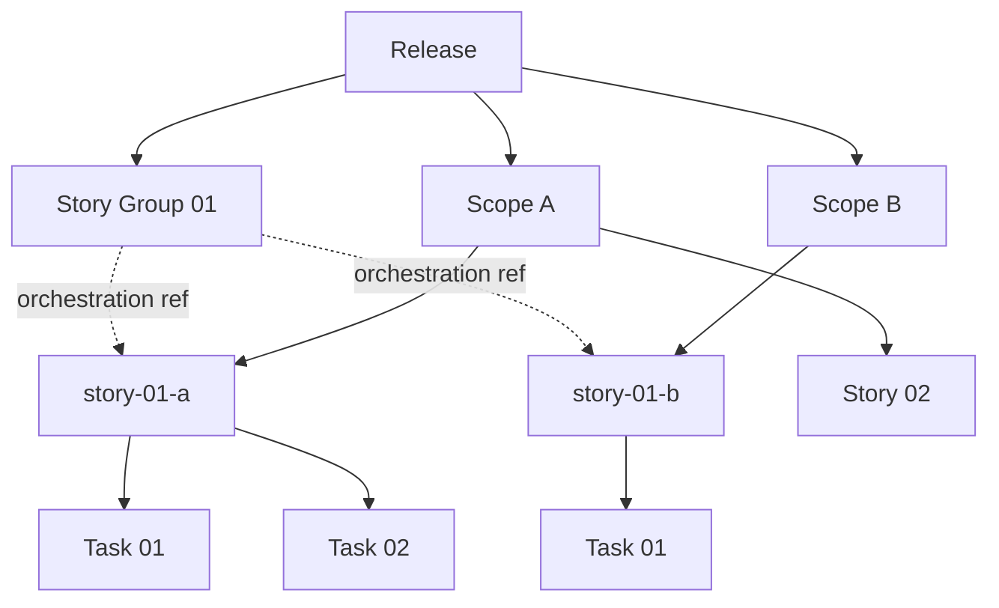
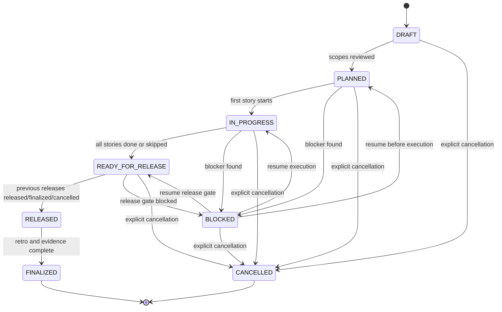
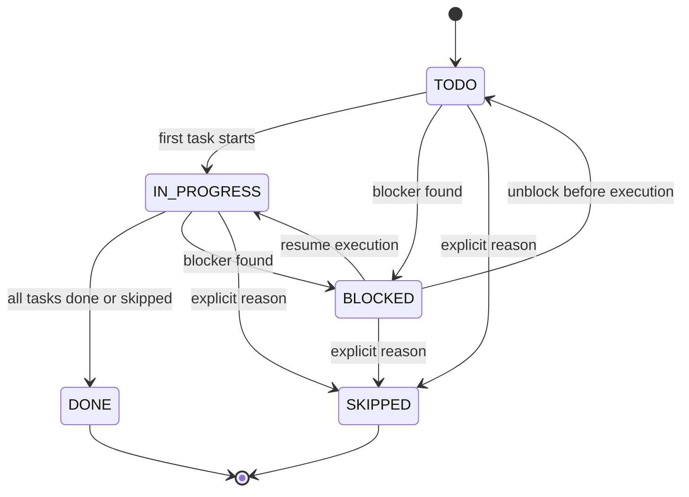
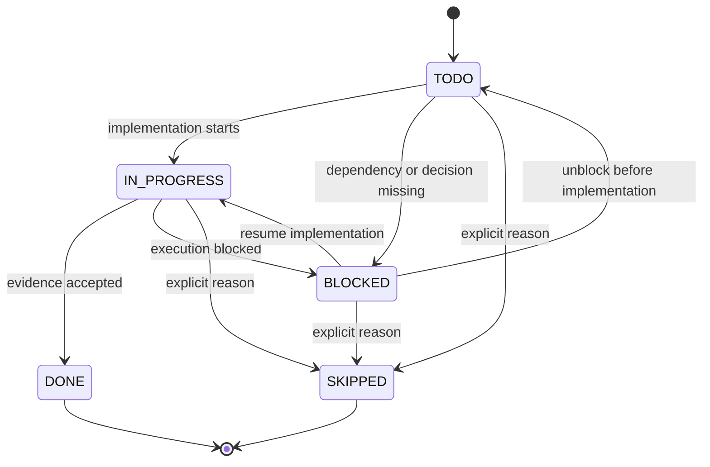

# Arquitectura objetivo

## Principios

1. Release primero: la release es la unidad publica de planificacion, seguimiento, liberacion y cierre.
2. Scopes configurables: las historias se agrupan por frentes del proyecto. `scope` es un nombre provisional; el concepto no debe quedar atado a `docs/`, `web/`, `api/`, `agents/` ni `infra/`.
3. Story/task casi intactas: se conserva la estructura actual de historias y tareas, incluyendo estado, riesgos, criterios, diseno tecnico, evidencia y workflow git.
4. Menos comandos publicos: un comando por intencion principal; las variaciones son etapas o flags.
5. Skills con responsabilidad unica: la skill coordina una intencion, no implementa la mecanica repetible.
6. Scripts deterministas por defecto: todo parseo, validacion, escritura de Markdown, indices, estados, secuencia y git plan debe vivir en scripts.
7. IA acotada: el agente solo interpreta producto, descompone trabajo, toma decisiones tecnicas justificadas, implementa codigo y revisa evidencia.
8. Minimo trabajo: si un dato ya existe en release, scope, story o task, se reutiliza; no se pide ni reescribe.
9. Templates desde el plugin: los templates y scripts canonicos se leen desde la instalacion del plugin. El repo de trabajo no recibe una copia completa de templates; solo guarda configuracion y artefactos generados.

## Modelo de datos propuesto

```text
.planning/
  releases/
    README.md
    release-001-slug/
      release.md
      scopes/
        web/
          scope.md
          task-guide.md
          test-guide.md
          story-01-a-name.md
          story-01-a-name/
            task-01-name.md
            task-02-name.md
        api/
          scope.md
          task-guide.md
          test-guide.md
          story-01-b-name.md
          story-01-b-name/
            task-01-name.md
      TRACEABILITY.md
      RETROSPECTIVE-RAW.md
```

No se mantienen `.planning/active/`, `.planning/finished/` ni `.releases/` como contrato de v4. Si algun script de v3 sirve, se reutiliza su logica interna, pero se adapta al modelo nuevo en vez de cargar una capa legacy.

Los archivos de la release se generan desde el template pack instalado con el plugin. `.planning/` no es una copia del template pack; es el estado del proyecto.

## Scope

`scope` es el nombre provisional para un frente configurable de trabajo dentro de una release. Puede mapear a carpetas, paquetes, repositorios, servicios, modulos, documentacion, infraestructura, procesos manuales o cualquier subdivision real del proyecto.

Ejemplos posibles, no normativos:

- `docs`
- `web`
- `api`
- `agents`
- `infra`
- `mobile`
- `data`
- `operations`
- `legal`

Reglas:

- Los scopes se configuran en `/release init`, con deteccion automatica de senales del repositorio y confirmacion humana.
- Una story pertenece a un scope principal.
- Una story no se ejecuta cruzando scopes. Si una capacidad afecta varios scopes, se divide en historias hermanas relacionadas: `story-01-a`, `story-01-b`, etc.
- Cada historia hermana vive dentro de la carpeta de su scope y tiene sus propias tasks atomizadas.
- El archivo padre `release.md` mantiene la referencia de orquestacion entre historias hermanas, dependencias y orden recomendado.
- Una task siempre pertenece al scope de su story. Si una tarea necesita tocar otro scope, se debe crear o vincular una historia hermana en ese otro scope.
- Cada scope puede tener `task-guide.md` y `test-guide.md`, generados desde la documentacion real del proyecto. Esas guias resumen como crear tareas tecnicas y pruebas para ese scope, y alimentan la automatizacion deterministica.
- Los scripts no deben asumir nombres de scope especificos; solo deben leer el catalogo configurado.

Diagrama estructural:



## Historias relacionadas multi-scope

Cuando al definir una historia se descubre que impacta mas de un scope, no se crea una planificacion adicional ni una historia unica con ownership ambiguo. Se crea un grupo de historias relacionadas.

Ejemplo:

```text
release-001-capability-name/
  release.md
  scopes/
    web/
      scope.md
      task-guide.md
      test-guide.md
      story-01-a-capability-ui.md
      story-01-a-capability-ui/
        task-01-form-layout.md
        task-02-submit-flow.md
    api/
      scope.md
      task-guide.md
      test-guide.md
      story-01-b-capability-api.md
      story-01-b-capability-api/
        task-01-command-contract.md
        task-02-persistence.md
```

`release.md` contiene la orquestacion:

| Story Group | Scope | Story | Depends On | Orchestration Notes |
|-------------|-------|-------|------------|---------------------|
| 01 | api | `story-01-b-capability-api` | -- | Define command contract first. |
| 01 | web | `story-01-a-capability-ui` | `story-01-b` | Uses API contract and maps validation errors. |

Reglas:

- El numero antes del sufijo (`01`) identifica el grupo funcional.
- El sufijo (`a`, `b`, `c`) identifica la parte scope-specific.
- Cada historia tiene estado propio.
- La release puede marcar el grupo como completo solo cuando todas sus historias requeridas estan `DONE` o `SKIPPED` con razon aceptada.
- Las dependencias entre historias relacionadas se declaran en `release.md`, no en planificaciones separadas.

## Estados propuestos

### Release



| Estado | Significado | Entrada permitida |
|--------|-------------|-------------------|
| `DRAFT` | Existe la release, puede cambiar alcance. | Creacion. |
| `PLANNED` | Historias candidatas definidas, dependencias y DoD revisadas. | Desde `DRAFT`. |
| `IN_PROGRESS` | Al menos una historia esta en ejecucion. | Desde `PLANNED`. |
| `READY_FOR_RELEASE` | Todas las historias incluidas estan `DONE` o `SKIPPED`; notas listas. | Desde `IN_PROGRESS`. |
| `RELEASED` | La entrega fue liberada. | Desde `READY_FOR_RELEASE`, solo si las releases anteriores ya estan `RELEASED` o `FINALIZED`. |
| `FINALIZED` | Retro, evidencia final, trazabilidad y archivo completados. | Desde `RELEASED`, solo si las releases anteriores estan `FINALIZED`. |
| `BLOCKED` | No puede avanzar sin resolver un bloqueo. | Desde `PLANNED`, `IN_PROGRESS` o `READY_FOR_RELEASE`. |
| `CANCELLED` | Se cancela explicitamente y queda fuera de la secuencia de entrega. | Solo con razon y confirmacion humana. |

### Story

Mantener casi igual:



Reglas adicionales:

- Toda story pertenece a exactamente una release activa.
- Toda story pertenece a exactamente un scope principal configurado.
- Una story relacionada multi-scope debe declarar `story_group` y `story_part`, por ejemplo `story_group: 01`, `story_part: a`.
- Una story debe tener una o mas tasks antes de pasar a `IN_PROGRESS`.
- Una story `DONE` requiere que todas sus tasks esten `DONE` o `SKIPPED`.

### Task

Mantener casi igual:



Reglas adicionales:

- Toda task pertenece a exactamente una story.
- Toda task pertenece al scope de su story; no hay override de scope en tasks.
- Una task no debe ejecutarse si sus dependencias no estan `DONE`.
- Para software, mantiene `Test Execution Evidence`, smoke, logging y diseno frontend/backend cuando aplique.

## Secuencia de releases

La creacion y la entrega tienen reglas distintas:

- Creacion: se puede crear `release-002` aunque `release-001` no este cerrada, pero no se puede crear `release-003` si falta `release-002`.
- Inicio: se puede planificar releases futuras, pero la ejecucion concurrente debe ser explicita. Por defecto, iniciar una release posterior con una anterior `IN_PROGRESS` requiere confirmacion humana.
- Liberacion: no se puede marcar `release-N` como `RELEASED` si existe una release anterior no `RELEASED`, `FINALIZED` o `CANCELLED`.
- Finalizacion: no se puede marcar `release-N` como `FINALIZED` si existe una release anterior no `FINALIZED` o `CANCELLED`.
- Cancelacion: debe registrar razon, impacto y decision humana. Una release cancelada conserva su numero y cuenta como cerrada para la secuencia.

## Responsabilidades deterministas

Scripts deben hacerse cargo de:

- asignar el siguiente numero de release sin saltos;
- validar transiciones de estados;
- impedir release/finalize fuera de orden;
- crear carpetas y archivos desde templates resueltos desde la instalacion del plugin;
- actualizar indices y tablas;
- sincronizar estado agregado de release desde stories/tasks;
- detectar tareas faltantes para stories;
- generar reportes y vistas;
- validar estructura, links, dependencias y evidencia;
- generar y refrescar indices/resumenes por scope desde documentacion funcional, tecnica, guias y decisiones aceptadas;
- generar esqueletos de task y test suite desde el `task-guide.md` y `test-guide.md` del scope;
- generar comandos git/gh permitidos, con modo dry-run por defecto;
- crear snapshots o exportaciones de lectura para workspaces viejos solo si se decide una herramienta externa de migracion.

## Responsabilidades del agente AI

El agente debe quedar limitado a:

- transformar intencion de negocio en historias candidatas;
- dividir una story en tasks tecnicas atomicas;
- sintetizar o actualizar la guia rapida de tasks/tests cuando la documentacion del scope no permite una generacion deterministica completa;
- completar secciones de diseno que requieren juicio;
- detectar riesgos y tradeoffs no triviales;
- implementar codigo;
- revisar evidencia y proponer correcciones;
- sintetizar retrospectivas a partir de hechos capturados.

Cuando el agente produzca historias o tasks, debe entregar un bloque estructurado que el script valida y aplica. El agente no deberia escribir manualmente indices, estados ni rutas derivables.

## Flujo feliz propuesto

```text
/plan-init
/release init
/release new --title "Capability name" --target 2026-Q3-M1-W2 --date 2026-08-07
/release plan release-001
/release scope add release-001 web
/release scope add release-001 api
/release story add release-001 api --group 01 --part b --title "Capability API"
/release story add release-001 web --group 01 --part a --title "Capability UI"
/release story link release-001 01 --depends web/story-01-a:api/story-01-b
/release story atomize release-001 api story-01-b
/release story atomize release-001 web story-01-a
/plan-story release-001 api story-01-b
/plan-task release-001 api story-01-b task-01
/release status release-001
/release mark release-001 READY_FOR_RELEASE
/release mark release-001 RELEASED
/release finalize release-001
```

La forma exacta del comando puede cambiar, pero el usuario debe sentir que navega release -> scope -> story -> task, no una coleccion de utilidades.
