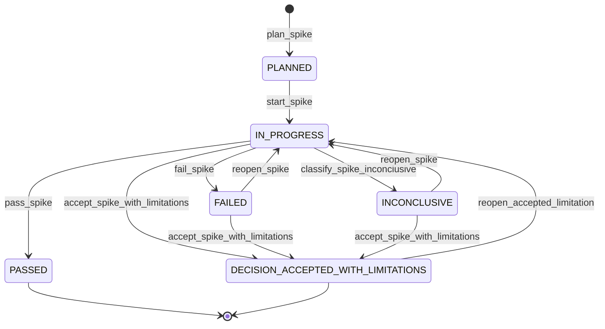
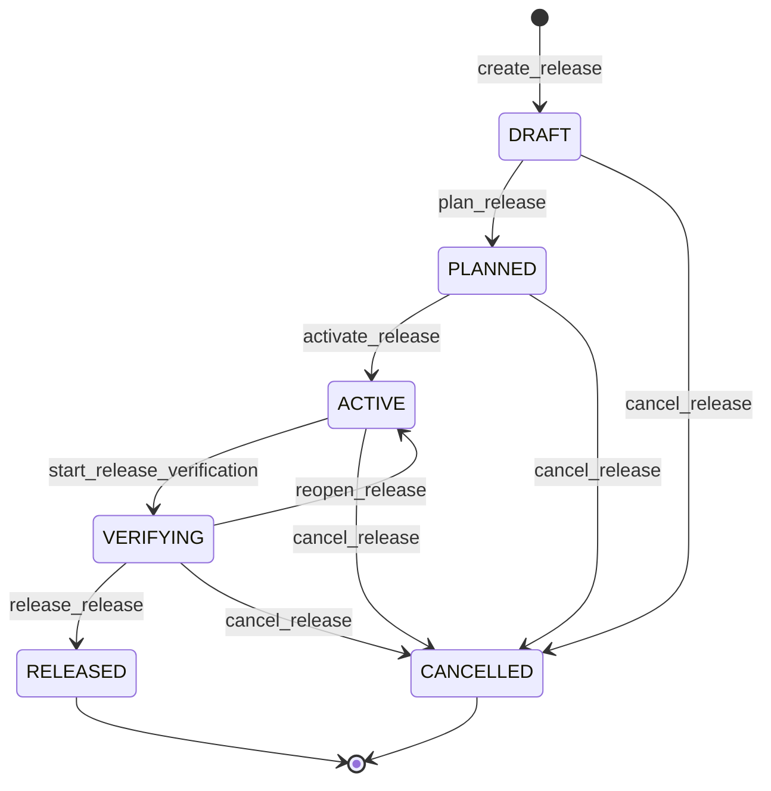

# Plan incremental

## Regla de trabajo

Esto es el producto next-generation `1.0.0` y parte en limpio. No hay compatibilidad hacia atras, aliases legacy ni storage paralelo por defecto. `v4` es solo una etiqueta historica de la iniciativa.

La recomendacion del review cambia el orden: no comenzar por una skill publica. Primero debe cerrarse el contrato del dominio, del naming y del runtime. La segunda revision agrega un Corte -1.1 obligatorio para resolver contradicciones residuales. La tercera revision agrega un Corte -1.2 de spikes tecnicos antes del runtime productivo. La cuarta revision aprueba ejecutar ese Corte -1.2, pero prohibe saltar al vertical slice mientras algun spike no tenga resultado aceptado.

## Corte -1: contrato del dominio y del runtime

Objetivo: definir el nucleo que hara segura la implementacion v4 antes de exponer comandos publicos.

Entregables:

- Modelo formal de `Release`, `Release Item`, `Scope Work Package`, `Task`, `Scope`, `Decision`, `Gate`, `Blocker`, `Waiver`, `Deployment Event` y `Finalization`.
- JSON Schema o equivalente para `config`, `plugin.lock`, `scope`, `release`, `release-item`, `work-package`, `task`, `change-set`, `operation`, `event` y `guide metadata`.
- Contrato de identidad estable: UUIDv7 como ID primario, `display_id` determinista e inmutable, slugs decorativos y referencias por ID primario.
- Contrato de storage: YAML/JSON canonico, Markdown como proyeccion, eventos JSON inmutables bajo `.planning/events/YYYY/MM/<event-id>.json`.
- Protocolo de mutacion: `inspect -> propose -> validate -> approve -> stage -> apply -> verify -> record`.
- Modelo de concurrencia: `baseRevisions` por agregado, optimistic locking, operation locks, idempotency keys y comportamiento en worktrees.
- Politicas configurables: release sequence, lanes, autonomy, approvals, gates, skip, cancelacion, deployment y finalizacion.
- Contrato seguro de comandos y custom generators: estructura de comando, cwd, timeouts, allowlist, path boundaries y permisos.
- Naming publico: el producto se expone exclusivamente mediante el namespace real del plugin y skills canonicas cortas.
- Fixtures de arquitectura:
  - monorepo software;
  - repositorio simple;
  - proyecto con scopes no-code;
  - dos worktrees concurrentes;
  - operacion multiarchivo fallida;
  - plugin actualizado con template pack historico;
  - entorno cross-platform Windows/WSL2.
- Pruebas de arquitectura para transiciones, dependencias, ciclos, IDs, concurrencia, idempotencia, atomicidad, staleness, reproducibilidad, path boundaries, cross-platform y ausencia legacy.

Validacion:

```text
node spikes/verify-corte-1.2.mjs
bash scripts/verify-next-generation.sh
```

## Corte -1.1: cerrar contradicciones del contrato

Objetivo: resolver los riesgos que aparecen al convertir la arquitectura en runtime real.

Cambios:

- Redisenar `config.yml` para que referencie el catalogo de scopes sin duplicar `scope.yml`.
- Reemplazar reglas ejecutables en Markdown por `task-guide.yml` y `test-guide.yml`; los `.md` quedan como proyeccion.
- Reemplazar `story.yml` como entidad general por `release-item.yml` con `kind: user_story | capability | defect | enabler | spike | compliance | migration | operational`.
- Separar Delivery Scope, Cross-cutting Concern y Gate Profile.
- Adoptar UUIDv7 como ID primario; conservar `display_id` determinista e inmutable como etiqueta humana.
- Cambiar `baseRevision` global por `baseRevisions` por agregado.
- Reemplazar `events.ndjson` como storage primario por eventos individuales inmutables bajo `.planning/events/YYYY/MM/<event-id>.json`.
- Definir `.planning/operations/<operation-id>/` con `operation.yml`, `change-set.json` y `result.json`; `before/`, `staged/` y logs viven bajo `.planning/.runtime/`.
- Modelar comandos externos como sagas: `prepare -> execute -> verify -> compensate`.
- Vincular aprobaciones al hash del ChangeSet.
- Hacer `/<product-name>:check` query-only; debe recomendar operaciones, no generar artefactos.
- Reemplazar `--dry-run`/`--write` como contrato mental por `propose/validate/approve/apply/verify`.
- Mover el launcher interno estable del plugin a `bin/<product-cli>`.
- Crear bundle self-contained en `runtime/dist/<product-cli>.mjs`.
- Definir estrategia historica de template packs con `.planning/vendor/template-packs/<fingerprint>/`.
- Agregar schemas faltantes: actor, approval, gate, blocker, risk, waiver, decision, deployment event, finalization, revision ref, command spec, provenance, resolution, release item y operation.

Validacion:

```text
node spikes/verify-corte-1.2.mjs
<product-cli> changeset validate <fixture-operation-id> --format json
bash scripts/verify-next-generation.sh
```

## Corte -1.2: spikes de producto y runtime

Objetivo: cerrar con evidencia los bloqueadores que no se pueden resolver solo con documentacion.

Cambios:

- Ejecutar naming gate antes de aprobar marca, paquete, binario o comandos definitivos.
- Validar discovery, autocomplete y ayuda del namespace real de plugins Claude Code sin cambiar la convencion `/<plugin-name>:<skill-name>`.
- Adoptar runtime self-contained JavaScript con Node.js 20+ obligatorio.
- Cambiar paths canonicos para que no dependan solo de `display_id` o slug.
- Definir merge protocol append-by-file: hijos referencian al padre e indices se regeneran como proyeccion.
- Acotar ChangeSet al control plane `.planning/**`; work product se registra como evidencia o se muta solo mediante operaciones explicitas limitadas.
- Convertir guias YAML en DSL cerrada con operadores validables.
- Crear catalogos canonicos para concerns, gates, gate profiles y environments.
- Definir hashing canonico para `content_revision`, fingerprints, operation hash, ChangeSet hash y render hash.
- Declarar eventos como auditoria inmutable, no event sourcing completo en la primera version.
- Separar `.planning/events/`, `.planning/operations/`, `.planning/.runtime/` y `.planning/vendor/` con politica Git/retencion.
- Exigir `propose` para reportes/renders que escriban proyecciones.
- Declarar trust model: guardrails cooperativos y trazabilidad, no sandbox contra agente malicioso con permisos del usuario.
- Adoptar producto nuevo `1.0.0`; el plugin actual 3.x queda en maintenance only.
- Formalizar contrato de permisos de skills: `allowed-tools`, `disable-model-invocation`, aprobaciones por stage, stop conditions y prohibicion de autoapproval.
- Definir limites de agregados: `ProjectContext`, `Scope`, `Release`, `ReleaseItem`, `WorkPackage` y `Task` como agregados relacionados, con consistencia fuerte local y consistencia transversal recomputable.
- Definir `display_id` determinista e inmutable derivado de UUIDv7, sin estado provisional ni aliases en 1.0.
- Adoptar RFC 8785 JSON Canonicalization Scheme para hashes canonicos y especificar tree hash para fingerprints de directorios.
- Separar `Execution Context` de `Deployment Environment`.
- Cerrar state machine formal de operaciones con transiciones, estados de recovery y fault matrix.

Validacion:

```text
node spikes/verify-corte-1.2.mjs
bash scripts/verify-next-generation.sh
```

Estados permitidos para cada spike:

```text
PLANNED
IN_PROGRESS
PASSED
FAILED
INCONCLUSIVE
DECISION_ACCEPTED_WITH_LIMITATIONS
```



| Evento | Transicion | Motivo o guard |
|--------|------------|----------------|
| `plan_spike` | inicial -> `PLANNED` | La hipotesis, alcance, timebox y criterios quedan definidos. |
| `start_spike` | `PLANNED` -> `IN_PROGRESS` | Se inicia el prototipo dentro del timebox aprobado. |
| `pass_spike` | `IN_PROGRESS` -> `PASSED` | La evidencia cumple los criterios de aprobacion. |
| `fail_spike` | `IN_PROGRESS` -> `FAILED` | La hipotesis falla o un criterio obligatorio no se cumple. |
| `classify_spike_inconclusive` | `IN_PROGRESS` -> `INCONCLUSIVE` | La evidencia no permite una decision confiable. |
| `reopen_spike` | `FAILED` o `INCONCLUSIVE` -> `IN_PROGRESS` | Se autoriza un nuevo intento con alcance o mitigacion revisados. |
| `accept_spike_with_limitations` | `IN_PROGRESS`, `FAILED` o `INCONCLUSIVE` -> `DECISION_ACCEPTED_WITH_LIMITATIONS` | Solo si todos los criterios fallidos son `critical: false` o `waivable: true`; requiere ADR. |
| `reopen_accepted_limitation` | `DECISION_ACCEPTED_WITH_LIMITATIONS` -> `IN_PROGRESS` | Se cumple la condicion de reapertura registrada en el ADR. |

El roadmap no puede avanzar a Corte 0 si existe un spike en `PLANNED`, `IN_PROGRESS`, `FAILED` o `INCONCLUSIVE`.

Cada spike declara `critical: true|false` y `waivable: true|false`. Cada criterio declara `severity` y `waivable`. `DECISION_ACCEPTED_WITH_LIMITATIONS` no puede cerrar un spike cuando falla un criterio `critical` con `waivable: false`.

Los criterios de integridad, ausencia de perdida de datos, reproducibilidad de hashes, aislamiento de paths e idempotencia son siempre `critical` y no waivable.

Spikes obligatorios:

1. Host integration: manifest, namespace, discovery, autocomplete/help, plugin root, plugin data, `bin/` en PATH del Bash tool, reload y update.
2. Runtime Node 20+: Node.js 20+ obligatorio, con evidencia Windows/WSL2/Linux/macOS.
3. Canonical core: UUIDv7, display ID determinista, canonical JSON RFC 8785, hashing, path normalization y evaluador DSL.
4. Worktree merge: create/create, edit/edit, delete/edit, supersede/edit e indices regenerables.
5. Transaction recovery: fallas despues de staging, primer write, canonical state, antes del evento, despues de comando externo, rollback, compensacion e idempotencia.
6. Integrated prototype: `init -> release -> item -> work package -> task -> propose -> apply -> check -> report`.

## Corte 0: bootstrap y configuracion del proyecto

Objetivo: hacer que `/<product-name>:init` configure lo necesario para que el plugin pueda trabajar agnosticamente en cualquier estructura.

Cambios:

- Crear exactamente:
  - `.planning/config.yml`
  - `.planning/plugin.lock.yml`
  - `.planning/events/`
  - `.planning/operations/`
  - `.planning/.runtime/`
  - `.planning/scopes/`
  - `.planning/concerns/`
  - `.planning/gates/`
  - `.planning/gate-profiles/`
  - `.planning/execution-contexts/`
  - `.planning/environments/`
  - `.planning/decisions/`
  - `.planning/releases/`
  - `.planning/vendor/template-packs/`
- Detectar y confirmar si el proyecto usa git.
- Si usa git, configurar branch base, estrategia de ramas, lanes y si se permitira automatizacion `git`/`gh`.
- Detectar carpetas, paquetes, workspaces o repositorios candidatos a scope.
- Pedir confirmacion humana del catalogo de scopes: id, nombre, kind, paths, owner opcional, reglas de validacion y `non_code` cuando aplique.
- Registrar donde viven historias fuente, backlog, master plan o documentos de producto, si existen.
- Registrar guias funcionales, tecnicas, arquitectura, estilo/coding, testing, logging, seguridad y producto.
- Registrar comandos de build/test/smoke como comandos estructurados, no strings de shell.
- Registrar autonomia: que puede inspeccionarse, proponerse, aplicarse o ejecutarse sin aprobacion.
- Generar o marcar pendientes las guias iniciales estructuradas por scope.
- Registrar plugin version, schema version y template pack fingerprint en `plugin.lock.yml`.

Validacion:

```text
<product-cli> workspace init propose --format json
<product-cli> changeset validate 0190f1c8-4e39-7a21-8bb2-2a45f8154ef1 --format json
<product-cli> changeset apply 0190f1c8-4e39-7a21-8bb2-2a45f8154ef1 --format json
<product-cli> check schema --format json
bash scripts/verify-next-generation.sh
```

## Corte 1: scope catalog y guias aprobables

Objetivo: convertir documentacion del proyecto en guias operativas versionadas para work packages, tasks y tests.

Cambios:

- Crear `.planning/scopes/<scope-id>/scope.yml`, `task-guide.yml`, `test-guide.yml`, `task-guide.md` y `test-guide.md`.
- Definir estados de guia: `generated`, `reviewed`, `approved`, `stale`, `rejected`.
- Guardar provenance: fuentes, fingerprints, generator version, model/prompt version cuando aplique, aprobador y fecha.
- Hacer que una guia no aprobada bloquee atomizacion automatica en modo estricto.
- Soportar generadores custom por scope con input/output estructurado y validacion de salida.
- Detectar staleness cuando cambian las fuentes configuradas.
- Agregar gates distintos por `kind` de scope.

Validacion:

```text
<product-cli> config guide refresh propose --scope <scope-id> --format json
<product-cli> changeset approve 0190f1c8-4e39-7a21-8bb2-2a45f8154ef1 --format json
<product-cli> changeset apply 0190f1c8-4e39-7a21-8bb2-2a45f8154ef1 --format json
<product-cli> check guides --format json
```

## Corte 2: release aggregate

Objetivo: establecer release como entidad principal sin sobrecargarla conceptualmente.

Cambios:

- Crear `release.yml` canonico y `README.md` generado.
- Definir lifecycle: `DRAFT`, `PLANNED`, `ACTIVE`, `VERIFYING`, `RELEASED`, `CANCELLED`.
- Modelar `finalization` como metadata y no como estado bloqueante del flujo principal.
- Separar lifecycle de `completion` y `readiness`; el runtime calcula esos campos sin transicionar automaticamente la release.
- Modelar deployment events por separado dentro del agregado de release.
- Definir `Execution Contexts` iniciales como `local`, `ci`, `container` o `preview`, y `Deployment Environments` iniciales como `beta`, `demo`, `staging`, `production` y custom targets configurables.
- Agregar policies configurables:
  - `strict_sequence`;
  - `dependency_graph`;
  - lanes como `main`, `hotfix` o `mobile`.
- Dejar `release_train` y `parallel` fuera del primer vertical slice.



| Evento | Transicion | Motivo o guard |
|--------|------------|----------------|
| `create_release` | inicial -> `DRAFT` | Se crea la release con identidad y alcance iniciales. |
| `plan_release` | `DRAFT` -> `PLANNED` | El alcance, dependencias y work packages requeridos son validos. |
| `activate_release` | `PLANNED` -> `ACTIVE` | Existe aprobacion para ejecutar el trabajo planificado. |
| `start_release_verification` | `ACTIVE` -> `VERIFYING` | El trabajo requerido fue entregado y se inicia la verificacion. |
| `release_release` | `VERIFYING` -> `RELEASED` | Readiness, gates y evidencia de release cumplen la policy. |
| `reopen_release` | `VERIFYING` -> `ACTIVE` | La verificacion detecta fallas corregibles y permite remediacion. |
| `cancel_release` | `DRAFT`, `PLANNED`, `ACTIVE` o `VERIFYING` -> `CANCELLED` | Cancelacion explicita con motivo y actor registrados. |
- Registrar `scope_refs` con indice de `guide_revision` para reproducibilidad, sin reemplazar los `guide_refs` obligatorios de cada Work Package.
- Regenerar `TRACEABILITY.md`, `RELEASE-NOTES.md` y reportes desde YAML canonico.
- Validar unicidad, formato y resolucion no ambigua de display IDs; no exigir continuidad sin saltos.

Validacion:

```text
<product-cli> release new propose --title <title> --format json
<product-cli> release status REL-5F11 --format json
<product-cli> check release REL-5F11 --format json
```

## Corte 3: release items y work packages

Objetivo: corregir el modelo multi-scope y reemplazar `story-01-a/story-01-b` por Release Items tipados con work packages por scope.

Cambios:

- Crear `release-item.yml` con `kind` y campos condicionales segun user story, capability, defect, enabler, spike, compliance, migration u operational work.
- Crear `work-package.yml` por scope con diseno tecnico, contratos, dependencias, riesgos, gates y tasks.
- Rechazar items multi-owner: un Release Item puede tener varios work packages, pero cada work package tiene un scope propietario.
- Agregar `commitment: required | optional`.
- Reemplazar `SKIPPED` por resolucion con razon, aprobacion, riesgo aceptado y reemplazo cuando aplique.
- Validar que un Release Item `DONE` requiere sus work packages requeridos `DONE` o una waiver/resolucion aceptada.
- Registrar dependencias entre Release Items y work packages por ID estable, no por slug/ruta.

Validacion:

```text
<product-cli> item create propose REL-5F11 --kind user_story --format json
<product-cli> item package add propose REL-5F11 ITEM-6041 --scope <scope-id> --format json
<product-cli> check item REL-5F11 ITEM-6041 --format json
```

## Corte 4: tasks y ejecucion atomica

Objetivo: adaptar `/<product-name>:task` al nuevo contexto `release -> release item -> work package -> task`.

Cambios:

- Permitir argumentos por IDs primarios o display IDs resueltos: `REL-5F11 ITEM-6041 WP-7131 TASK-7A21`.
- Rechazar `NNN-slug story-01 task-01` como forma v4.
- Hacer que `task.yml` herede scope y gates desde `work-package.yml`.
- Mantener `Test Execution Evidence`, smoke, logging y diseno frontend/backend cuando aplique al kind del scope.
- Ejecutar todo cambio via ChangeSet con `baseRevisions` e idempotency key.
- Guardar comandos ejecutados como estructura y eventos observables.
- Agregar rollback tecnico o compensacion cuando una operacion falla despues de escribir.

Validacion:

```text
<product-cli> task inspect REL-5F11 ITEM-6041 WP-7131 TASK-7A21 --format json
<product-cli> task start propose REL-5F11 ITEM-6041 WP-7131 TASK-7A21 --format json
<product-cli> task closeout REL-5F11 ITEM-6041 WP-7131 TASK-7A21 --format json
```

## Corte 5: check/report/docs

Objetivo: reducir comandos duplicados sin perder capacidades.

Cambios:

- Crear `/<product-name>:check` como wrapper query-only de invariantes, schemas, guide freshness, gates, readiness, links, dependencies y evidence.
- Crear `/<product-name>:report` para status, standup, history, export, release notes, traceability, docs generadas y exports.
- Reportar drift de Markdown y recomendar operaciones de regeneracion; no mutar desde checks.
- Centralizar salida markdown/json.

Reemplazos v4:

```text
/plan-health         -> /<product-name>:check health
/plan-validate       -> /<product-name>:check schema
/plan-task-validate  -> /<product-name>:check task
/plan-audit-docs     -> /<product-name>:check docs
/plan-doctor         -> /<product-name>:check doctor
/plan-status         -> /<product-name>:report status
/plan-standup        -> /<product-name>:report standup
/plan-history        -> /<product-name>:report history
/plan-export         -> /<product-name>:report export
/doc-task            -> /<product-name>:report docs --level task
/doc-story           -> /<product-name>:report docs --level release-item
/doc-generate        -> /<product-name>:report docs
```

## Corte 6: skills publicas

Objetivo: exponer la superficie v4 cuando el runtime ya tenga contrato, storage y pruebas.

Cambios:

- Crear `skills/init/SKILL.md`.
- Crear `skills/config/SKILL.md`.
- Crear `skills/release/SKILL.md` como router del lifecycle de release.
- Crear `skills/item/SKILL.md`.
- Crear `skills/task/SKILL.md`.
- Crear `skills/check/SKILL.md`.
- Crear `skills/report/SKILL.md`.
- Crear `skills/decision/SKILL.md`.
- Crear `skills/update/SKILL.md` para mantenimiento del plugin/template pack.
- No crear comandos avanzados hasta tener una necesidad real.

Cada skill debe ser un wrapper pequeno: argumentos, precondiciones, llamada al launcher, punto de juicio del agente y criterios de aprobacion.

## Corte 7: consolidar backlog/import/recovery si corresponde

Objetivo: mover comandos secundarios fuera del flujo principal.

Cambios:

- Crear `/<product-name>:backlog` solo si se decide mantener backlog externo como capacidad explicita.
- Crear `/<product-name>:recover` solo si el event journal y ChangeSets ya soportan retry, rollback y compensacion.
- Reubicar `plan-from-release` como etapa de `/<product-name>:release plan` o `/<product-name>:item import` si todavia aporta.
- Mantener `decision` separado porque registra decisiones transversales reales.

## Corte 8: cierre de ruptura v4

Objetivo: dejar una superficie limpia y publicar el cambio como major.

Cambios:

- Confirmar contra `CHANGELOG.md`, manifests y naming gate que el producto next-generation se publica como producto nuevo `1.0.0`.
- Ejecutar la eliminacion legacy definida en [Eliminacion legacy](06-eliminacion-legacy.md).
- Actualizar manifests y metadata: `.claude-plugin/plugin.json`, `.claude-plugin/marketplace.json`, README badge y `.page/package*.json`.
- Rehacer documentacion publica: README, `docs/commands.yml`, reference, user guide, developer guide, tutoriales, workflows y glossary.
- Rehacer site/landing desde `.page` para mostrar solo el flujo v4 y validar con `npm run build`.
- Rehacer `runtime/`, `runtime/src/schemas/` y `template-pack/`. `/<product-name>:init` no copia templates completos al repo de trabajo.
- Actualizar `scripts/verify-plugin.sh` para validar ausencia legacy en skills, docs, template, site, manifests y version markers.
- Actualizar `CHANGELOG.md`.
- Actualizar `template-pack/update-version/<N>-<N+1>.md`.
- Documentar tabla de comandos removidos y reemplazos.
- Definir si existe una herramienta separada de export/migracion desde v3. Esa herramienta no condiciona el diseno v4.

## Primer corte recomendado

El primer cambio implementable debe ser pequeno, pero previo a comandos publicos:

1. Crear schemas minimos para `config`, `plugin.lock`, `scope`, `release`, `release-item`, `work-package`, `task`, `change-set`, `operation` y `event`.
2. Crear librerias base de identidad, revision, paths, ChangeSet, atomic write y event journal.
3. Agregar fixtures para monorepo, repo simple y scope no-code.
4. Agregar checks de arquitectura en `scripts/verify-plugin.sh`.
5. Documentar el launcher estable y los contratos en developer guide.

Despues de cerrar Corte -1, Corte -1.1 y Corte -1.2, implementar el primer vertical slice:

```text
init
  -> config
  -> scope catalog
  -> release
  -> release item
  -> work package
  -> task
  -> check
  -> report
```

Sin ejecucion autonoma, Git/gh mutante, recovery, backlog externo ni deployment en el primer vertical slice.

## Decisiones cerradas

1. Producto nuevo `1.0.0`; el plugin actual 3.x queda en maintenance only.
2. Runtime self-contained JavaScript con Node.js 20+ obligatorio.
3. UUIDv7 es el unico ID primario.
4. Display IDs deterministas e inmutables derivados del UUIDv7.
5. Las relaciones padre-hijo son inmutables; trasladar trabajo crea un reemplazo.

## Criterio de exito

La documentacion principal deberia poder explicar el plugin con este mapa:

```text
1. Inicializa el proyecto.
2. Configura scopes y politicas.
3. Crea una release.
4. Define release items tipados.
5. Divide cada item en work packages por scope.
6. Atomiza cada work package en tasks.
7. Ejecuta operaciones mediante ChangeSets.
8. Verifica gates y evidencia.
9. Libera y registra deployment.
10. Finaliza y genera retrospectiva.
```

Si hace falta una tabla de "comandos similares" para entender que usar, todavia no esta suficientemente simple.
