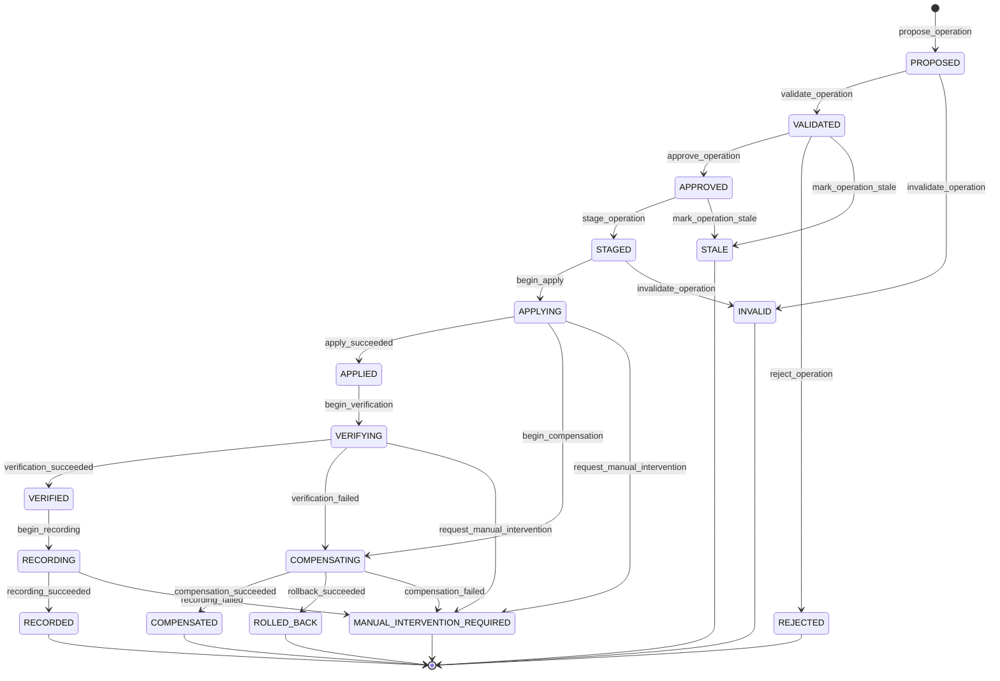

# Corte -1.1: contratos residuales del runtime

## Objetivo

La segunda revision experta aprueba la arquitectura para avanzar al Corte -1, pero identifica contradicciones que deben cerrarse antes de escribir runtime productivo. Este documento convierte esas observaciones en contrato de diseno. La tercera revision no invalida este corte, pero lo extiende con spikes obligatorios en [Corte -1.2](09-corte-1-2-spikes-producto-runtime.md).

Regla:

```text
No implementar runtime productivo hasta cerrar este Corte -1.1.
```

## 1. Fuente unica de scopes

`config.yml` no contiene la definicion completa de scopes. Solo referencia el catalogo:

```yaml
scope_catalog:
  directory: .planning/scopes
  enabled:
    - web
    - api
    - legal
```

La fuente canonica vive en:

```text
.planning/scopes/<scope-id>/scope.yml
```

`scope.yml` contiene `id`, `display_id`, `label`, `kind`, ownership, paths, non-code justification, sources, dependencies, concerns, guide refs y validation profiles.

## 2. Guias estructuradas

Markdown no puede ser regla ejecutable. Cada scope tiene guias estructuradas y proyecciones humanas:

```text
.planning/scopes/web/
  scope.yml
  task-guide.yml
  test-guide.yml
  task-guide.md
  test-guide.md
```

Los `.yml` contienen:

- tipos de Work Package;
- tipos de Task;
- gates;
- required sections;
- decomposition rules estructuradas;
- test matrix;
- command references;
- evidence requirements;
- provenance por guia.

Los `.md` explican la guia para humanos y agentes, pero el runtime no los interpreta como base de datos.

## 3. Release Item tipado

La entidad canonica dentro de una release es `Release Item`. `Story/Capability` queda como lenguaje de producto, no como unico tipo de entidad.

```yaml
kind: user_story | capability | defect | enabler | spike | compliance | migration | operational
```

Campos condicionales:

| Kind | Campos requeridos |
|------|-------------------|
| `user_story` | actor, need, value, acceptance_criteria |
| `capability` | outcome, behavior, acceptance_criteria |
| `defect` | observed_behavior, expected_behavior, reproduction, severity |
| `enabler` | technical_outcome, unlocked_capabilities |
| `spike` | question, timebox, expected_decision |
| `compliance` | obligation, authority, deadline, evidence |
| `migration` | source_state, target_state, rollback |
| `operational` | procedure, owner, evidence |

`release-item.yml` reemplaza a un `story.yml` demasiado ambiguo. El termino `story` puede mantenerse como alias conversacional para `kind: user_story`, pero no como schema unico.

## 4. Scopes, concerns y gate profiles

Un scope representa una unidad de delivery/ownership. No debe absorber todos los conceptos transversales.

Separar:

```text
Delivery Scope
Cross-cutting Concern
Gate Profile
```

Ejemplo:

```yaml
paths:
  overlap_policy: reject | allow | explicit

scope_dependencies:
  - from: web
    to: design-system

concerns:
  - id: security
    applies_to:
      - web
      - api

gate_profiles:
  - id: security-default
    gates:
      - threat-model
      - dependency-audit
```

Los scopes pueden solaparse solo cuando `overlap_policy` lo permite y la dependencia queda declarada.

## 5. Identidad distribuida

Los IDs secuenciales no son claves primarias. La identidad primaria debe ser distribuida:

```yaml
id: 01J4F0Z9M...
display_id: T-7H3K9
slug: validate-schema
```

Reglas:

- `id` es la clave primaria y se usa en referencias internas.
- `display_id` es etiqueta humana y puede asignarse al crear, integrar o renderizar.
- `slug` es decorativo.
- UUIDv7 evita colisiones entre worktrees y agentes.

## 6. Revisiones por agregado

Un `baseRevision` global invalida operaciones por cambios no relacionados. El ChangeSet debe declarar revisiones por agregado leido:

```json
{
  "baseRevisions": {
    "projectConfig": "sha256:...",
    "scope:web": "sha256:...",
    "guide:web:task": "sha256:...",
    "release:01J...": "sha256:...",
    "releaseItem:01J...": "sha256:...",
    "workPackage:01J...": "sha256:..."
  }
}
```

Una operacion falla solo si cambia un agregado que la operacion leyo o muta.

## 7. Event journal por archivos inmutables

`events.ndjson` no es storage primario. Es proyeccion/export.

Storage primario:

```text
.planning/events/
  2026/
    07/
      01J4E-release-created.json
      01J4F-task-started.json
```

Cada evento declara `event_id`, `type`, aggregate, timestamp UTC, actor, operation_id, idempotency_key, payload, input_hash y output_hash. El orden se deriva de UUIDv7/timestamp/causal references, no del orden de lineas.

## 8. Operaciones multiarchivo

Cada operacion usa directorios propios. El manifest resumido puede versionarse:

```text
.planning/operations/<operation-id>/
  operation.yml
  change-set.json
  result.json
```

Los archivos de staging, snapshots `before/` y logs viven en runtime storage no versionado por defecto:

```text
.planning/.runtime/operations/<operation-id>/
  before/
  staged/
  logs/
```

Estados:

```text
PROPOSED
INVALID
VALIDATED
APPROVED
REJECTED
STALE
STAGED
APPLYING
APPLIED
VERIFYING
VERIFIED
RECORDING
RECORDED
COMPENSATING
COMPENSATED
ROLLED_BACK
MANUAL_INTERVENTION_REQUIRED
```

State machine inicial:

El campo `state` no se puede editar arbitrariamente. Cada cambio debe ser consecuencia de un evento de transicion autorizado, con motivo, actor, precondiciones y evidencia registrados.



| Evento | Transicion | Motivo o guard |
|--------|------------|----------------|
| `propose_operation` | inicial -> `PROPOSED` | Se crea un ChangeSet con base revisions y alcance declarados. |
| `validate_operation` | `PROPOSED` -> `VALIDATED` | Schemas, boundaries, precondiciones y concurrencia pasan. |
| `invalidate_operation` | `PROPOSED` o `STAGED` -> `INVALID` | Se detecta un error antes de aplicar efectos. |
| `approve_operation` | `VALIDATED` -> `APPROVED` | Un actor autorizado aprueba el ChangeSet vigente. |
| `reject_operation` | `VALIDATED` -> `REJECTED` | Un actor autorizado rechaza la propuesta con motivo registrado. |
| `mark_operation_stale` | `VALIDATED` o `APPROVED` -> `STALE` | Cambia una base revision o una precondicion antes de aplicar. |
| `stage_operation` | `APPROVED` -> `STAGED` | Se preparan snapshots y escrituras sin mutar el estado canonico. |
| `begin_apply` | `STAGED` -> `APPLYING` | Se inicia la mutacion autorizada e idempotente. |
| `apply_succeeded` | `APPLYING` -> `APPLIED` | Todas las escrituras previstas terminan correctamente. |
| `begin_compensation` | `APPLYING` -> `COMPENSATING` | La aplicacion produjo un efecto que requiere recovery. |
| `request_manual_intervention` | `APPLYING` o `VERIFYING` -> `MANUAL_INTERVENTION_REQUIRED` | No existe recovery automatico seguro. |
| `begin_verification` | `APPLIED` -> `VERIFYING` | Las escrituras terminaron y se inicia la comprobacion. |
| `verification_succeeded` | `VERIFYING` -> `VERIFIED` | Postcondiciones, hashes y referencias quedan comprobados. |
| `verification_failed` | `VERIFYING` -> `COMPENSATING` | La operacion tuvo efectos, pero la comprobacion no pasa. |
| `begin_recording` | `VERIFIED` -> `RECORDING` | Se inicia la persistencia de eventos, manifest y proyecciones. |
| `recording_succeeded` | `RECORDING` -> `RECORDED` | La auditoria y las proyecciones quedan registradas. |
| `recording_failed` | `RECORDING` -> `MANUAL_INTERVENTION_REQUIRED` | No se puede garantizar el registro completo automaticamente. |
| `compensation_succeeded` | `COMPENSATING` -> `COMPENSATED` | La compensacion finaliza y su resultado es verificable. |
| `rollback_succeeded` | `COMPENSATING` -> `ROLLED_BACK` | El rollback finaliza y el estado anterior queda verificado. |
| `compensation_failed` | `COMPENSATING` -> `MANUAL_INTERVENTION_REQUIRED` | La compensacion no puede garantizar consistencia automatica. |

Semantica obligatoria:

- `INVALID`: error detectado antes de aplicar efectos.
- `APPLYING`: la operacion ya comenzo a mutar.
- `VERIFYING`: las escrituras terminaron, pero aun no estan aprobadas como validas.
- `VERIFIED`: las postcondiciones y hashes pasaron.
- `RECORDING`: se estan persistiendo eventos, manifest y proyecciones.
- `COMPENSATING`: hubo efectos y se esta ejecutando recovery.
- `MANUAL_INTERVENTION_REQUIRED`: no existe recovery automatico seguro.

El manifest de operacion debe registrar:

```yaml
state: PROPOSED
previous_state: null
transition_reason: created
actor: system
evidence: []
attempt: 1
started_at: 2026-07-22T00:00:00Z
updated_at: 2026-07-22T00:00:00Z
recovery_required: false
manual_action: null
```

La operacion debe:

1. cargar revisiones por agregado;
2. validar schemas;
3. validar boundaries;
4. construir staging;
5. comprobar postcondiciones simuladas;
6. bloquear agregados afectados cuando comparten filesystem;
7. aplicar estado canonico;
8. verificar;
9. registrar eventos;
10. regenerar proyecciones.

Cada transicion debe estar declarada en el schema y registrar actor, motivo,
timestamp, evidence y `previous_state`. Todos los estados requieren tests
positivos y negativos.

La matriz de fallas del Corte -1.2 debe cubrir crash despues de `APPLIED`, evento no registrado, postcondition fallida, verificacion fallida, compensacion parcial, comando externo exitoso con write local fallido, ChangeSet obsoleto despues de aprobacion, rollback imposible y reintento idempotente.

## 9. Comandos externos como saga

Git, GitHub, deployments, test environments y APIs externas no son atomicamente reversibles.

Se modelan como saga:

```text
prepare -> execute -> verify -> compensate
```

El ChangeSet debe declarar rollback tecnico, compensacion logica o rollback imposible.

## 10. Approval binding

La aprobacion se vincula al hash del ChangeSet:

```yaml
approval:
  actor: ...
  change_set_hash: sha256:...
  approved_at: ...
```

Modificar el ChangeSet invalida la aprobacion.

## 11. CQS para checks y reportes

`check` no muta. Solo valida, reporta y recomienda operaciones:

```json
{
  "valid": false,
  "findings": [],
  "recommendedOperations": []
}
```

La generacion vive en `item atomize`, `task prepare` o `config guide refresh`.

`report` puede emitir stdout sin mutar. Si escribe proyecciones Markdown, debe hacerlo via `report render propose` y ChangeSet.

## 12. Vocabulario unico de mutacion

No mezclar `dry-run/write` con ChangeSets como modelo mental.

CLI conceptual:

```text
<product-cli> workspace init propose
<product-cli> changeset validate OP-...
<product-cli> changeset approve OP-...
<product-cli> changeset apply OP-...
<product-cli> changeset verify OP-...
```

Los comandos publicos pueden ocultar parte de esta mecanica, pero el runtime conserva el contrato `propose/validate/approve/apply/verify`.

## 13. Launcher interno y bundle

El launcher interno estable del plugin vive en la raiz. El nombre exacto queda pendiente del naming gate:

```text
bin/
  <product-cli>
```

El runtime compilado vive en:

```text
runtime/
  src/
  dist/
    <product-cli>.mjs
  package.json
  package-lock.json
  build.mjs
```

El bundle debe ser self-contained. No se asume `npm install` en el workspace usuario.

Debe incluir parser YAML, JSON Schema validator, parser de argumentos, hashing, globbing, locks y renderers.

Esto no elimina la dependencia del runtime de ejecucion. El producto next-generation usa un bundle JavaScript self-contained con Node.js 20+ obligatorio.

## 14. Template pack historico

`plugin.lock.yml` debe permitir reproducibilidad historica. Un fingerprint solo no basta si el template desaparece.

Estrategia recomendada:

```text
.planning/vendor/template-packs/<fingerprint>/
```

Guardar solo templates realmente utilizados por el workspace. El runtime puede validar con el pack instalado actual, pero debe poder regenerar o auditar artefactos historicos con el snapshot vendor cuando el lock lo requiera.

## 15. Schemas faltantes

Crear schemas propios o `$defs` reutilizables:

```text
actor.schema.json
approval.schema.json
gate.schema.json
blocker.schema.json
risk.schema.json
waiver.schema.json
decision.schema.json
deployment-event.schema.json
finalization.schema.json
revision-ref.schema.json
command-spec.schema.json
provenance.schema.json
resolution.schema.json
release-item.schema.json
operation.schema.json
```

`deployment-event.schema.json` debe cubrir al menos:

```yaml
deployment_environment: beta | demo | staging | production | custom
execution_context: ci | local | preview | custom
artifact_version: ...
commit_sha: ...
started_at: ...
completed_at: ...
result: succeeded | failed | rolled_back
verification: ...
rollback: ...
```

## Criterio de salida del Corte -1.1

El Corte -1.1 puede considerarse cerrado cuando se cumplan los siguientes contratos.

- no existan fuentes duplicadas;
- todos los estados operativos tengan schema;
- la identidad UUIDv7 sea segura en worktrees;
- la atomicidad multiarchivo este definida;
- el launcher funcione instalado desde `bin/`;
- las dependencias esten empaquetadas;
- el journal no cause conflictos sistematicos;
- el template pack pueda resolverse de forma reproducible;
- `check` sea query-only;
- el vocabulario `propose/apply/verify` sea el unico contrato de mutacion.

El inicio del runtime productivo continua bloqueado hasta cerrar tambien el Corte -1.2.
