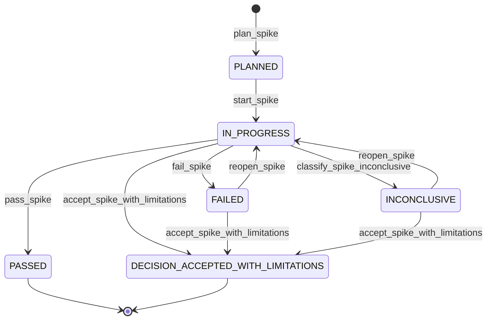

# Corte -1.2: spikes de producto y runtime

## Objetivo

La tercera revision experta aprueba el dominio `release -> release item -> scope work package -> task`, pero no aprueba todavia el naming definitivo ni el runtime productivo. La cuarta revision aprueba ejecutar este corte y aclara que los spikes documentados no son evidencia de resolucion. Este corte amplifica el Corte -1.1 con decisiones que solo pueden cerrarse mediante prototipos, fixtures, pruebas y ADRs.

Regla:

```text
No iniciar el vertical slice productivo hasta cerrar los spikes de este corte.
```

## 1. Naming gate

`ARC Flow` y `arcflow` quedan como codename, no como marca aprobada.

Antes de modificar manifests, sitio, paquetes o binarios definitivos, validar:

- GitHub;
- npm;
- PyPI;
- crates.io;
- Homebrew;
- Chocolatey;
- dominios;
- marketplaces;
- buscadores;
- nombres de binarios instalables;
- marcas o productos relevantes.

Criterios:

- distintivo;
- corto;
- pronunciable;
- buscable;
- disponible;
- no atado exclusivamente a Claude;
- compatible con plugin y CLI;
- sin duplicacion incomoda con slash commands namespaced.

## 2. Namespace real de plugin

La API publica debe disenarse como composicion:

```text
plugin name + skill name
```

No asumir que una skill se vera como comando standalone. El host puede mostrar:

```text
/<product-name>:init
/<product-name>:config
/<product-name>:release
```

Por eso los nombres canonicos de skills deben ser cortos:

```text
skills/init/
skills/config/
skills/release/
skills/item/
skills/task/
skills/check/
skills/report/
skills/decision/
skills/update/
```

Un prefijo por acronimo, por ejemplo `/<acronym>-init`, solo es fallback si el spike demuestra que el namespace del plugin no queda visible o no es usable.

## 3. Runtime prerequisite

Un bundle JavaScript self-contained elimina `npm install`, pero no elimina Node.js.

Decision requerida:

```text
Opcion A: bundle JavaScript + Node.js 20+ obligatorio
Opcion B: binarios nativos por plataforma
Opcion C: instalacion administrada del runtime
```

Si se elige Node obligatorio, el launcher debe hacer preflight:

- `node` disponible;
- version minima;
- permisos de ejecucion;
- ruta del plugin root;
- mensaje de instalacion claro;
- salida JSON para skills.

## 4. Paths canonicos

Los IDs primarios distribuidos no bastan si el filesystem usa solo `display_id`.

Prohibido como path canonico:

```text
R0001-slug/
RI0001-slug/
WP0001-slug/
T0001-slug/
```

Opciones permitidas:

```text
releases/<primary-id>/
items/<primary-id>/
work-packages/<primary-id>/
tasks/<primary-id>/
```

o path hibrido:

```text
RI0004-7H3K9-publish-assessment/
```

El `display_id` y el slug son para lectura humana y proyecciones. Las referencias internas usan `id`.

## 5. Merge protocol

Evitar listas de hijos en padres como fuente canonica.

Preferir:

```yaml
# release-item.yml
release_id: 01J-RELEASE
```

En vez de:

```yaml
# release.yml
items:
  - 01J-ITEM-A
  - 01J-ITEM-B
```

Los indices de hijos son proyecciones regenerables. Operaciones que modifican padres requieren single writer, lock de agregado, reconciliacion explicita o nueva propuesta despues del merge.

## 6. Limite del ChangeSet

El ChangeSet controla obligatoriamente el control plane:

```text
.planning/**
policies
operations
events
approvals
state transitions
canonical metadata
```

El work product se registra como evidencia:

```text
src/**
tests/**
infra/**
product docs
configuration
```

El runtime no debe convertirse en editor universal de codigo. Puede generar templates, skeletons, documentacion o configuracion solo mediante operaciones explicitas y limitadas.

Ejemplo de evidencia:

```yaml
work_product:
  git_diff_hash: sha256:...
  commit_sha: ...
  changed_paths:
    - src/...
  verification_refs:
    - test-run:...
```

## 7. DSL de guias

YAML no basta si contiene lenguaje natural como regla ejecutable.

Las guias deben usar una DSL cerrada para:

- applicability;
- required sections;
- ordering;
- dependency;
- gate selection;
- evidence requirements;
- command selection;
- execution context selection;
- deployment environment selection.

Operadores permitidos iniciales:

```text
equals
not_equals
contains
exists
all
any
not
in
matches
```

Ejemplo:

```yaml
applies_when:
  all:
    - field: item.kind
      op: in
      value:
        - user_story
        - capability
    - field: item.tags
      op: contains
      value: ui

ordering:
  - predecessor_type: contract-check
    successor_type: real-api-connection
```

La narrativa puede vivir en `description`, pero no controla automatizacion.

## 8. Catalogos canonicos

Agregar storage canonico para conceptos transversales:

```text
.planning/
  concerns/
    security.yml
    accessibility.yml
  gates/
    unit-tests.yml
    threat-model.yml
    accessibility-review.yml
  gate-profiles/
    security-default.yml
    frontend-default.yml
  execution-contexts/
    local.yml
    ci.yml
    preview.yml
  environments/
    beta.yml
    staging.yml
    demo.yml
    production.yml
```

IDs de catalogo usan claves humanas validadas:

```text
web
unit-tests
security
deploy-beta
```

Entidades runtime usan IDs distribuidos:

```text
release
release item
work package
task
event
operation
```

## 9. Hashing canonico

Definir pipeline unico:

```text
YAML 1.2 seguro
-> objeto validado
-> eliminar campos no semanticos
-> canonical JSON RFC 8785
-> UTF-8
-> SHA-256
```

Rechazar:

- claves duplicadas;
- custom tags;
- aliases peligrosos;
- anchors no permitidos;
- valores ambiguos;
- tipos implicitos de YAML 1.1.

Distinguir:

```text
content_revision
source_fingerprint
template_fingerprint
operation_hash
change_set_hash
render_hash
tree_hash
```

`revision` no puede incluir su propio campo `revision` en el hash.

El fingerprint de directorios debe declarar paths normalizados, orden lexicografico, politica de symlinks, exclusiones, interaccion con Git ignore y hash de contenido, como tree hash o manifest Merkle.

## 10. Eventos, operaciones y retencion

Decision inicial:

```text
YAML/JSON de agregados = estado canonico
eventos = auditoria inmutable
```

No implementar event sourcing completo en la primera version.

Storage operativo:

```text
.planning/events/              # auditoria versionable
.planning/operations/          # manifests resumidos, versionable segun policy
.planning/.runtime/            # staging, before, logs; gitignored
.planning/vendor/              # snapshots segun lock
```

Politica ejemplo:

```yaml
runtime:
  operation_retention_days: 7
  retain_failed_operations: true
  retain_before_snapshots: false
  event_retention: permanent
```

Debe existir mantenimiento para archive, purge y report sin romper locks ni evidencia requerida.

## 11. Reportes y renders

`check` es query-only.

`report` puede escribir solo si usa una operacion:

```text
<product-cli> report render propose
<product-cli> changeset apply OP-...
```

Status, readiness, release notes y traceability pueden salir a stdout sin mutar.

## 12. Trust model

La aprobacion no es una frontera criptografica si el agente puede ejecutar el launcher.

Declaracion requerida:

```text
El sistema provee guardrails, trazabilidad y human-in-the-loop cooperativo. No es una sandbox frente a un agente malicioso con acceso equivalente al usuario.
```

Refuerzos:

- confirmacion explicita;
- actor y sesion;
- texto de aprobacion;
- policy que prohiba autoapproval;
- challenge interactivo;
- hooks;
- deteccion de drift;
- permisos de filesystem cuando sea posible;
- auditoria de llamadas.

## 13. Estado y template de spikes

Estados permitidos:

```text
PLANNED
IN_PROGRESS
PASSED
FAILED
INCONCLUSIVE
DECISION_ACCEPTED_WITH_LIMITATIONS
```



| Evento | Transicion | Motivo o guard |
|--------|------------|----------------|
| `plan_spike` | inicial -> `PLANNED` | La hipotesis, alcance, timebox y criterios quedan definidos. |
| `start_spike` | `PLANNED` -> `IN_PROGRESS` | Se inicia el prototipo dentro del timebox aprobado. |
| `pass_spike` | `IN_PROGRESS` -> `PASSED` | La evidencia cumple los criterios de aprobacion. |
| `fail_spike` | `IN_PROGRESS` -> `FAILED` | La hipotesis falla o un criterio obligatorio no se cumple. |
| `classify_spike_inconclusive` | `IN_PROGRESS` -> `INCONCLUSIVE` | La evidencia no permite una decision confiable. |
| `reopen_spike` | `FAILED` o `INCONCLUSIVE` -> `IN_PROGRESS` | Se autoriza un nuevo intento con alcance o mitigacion revisados. |
| `accept_spike_with_limitations` | `IN_PROGRESS`, `FAILED` o `INCONCLUSIVE` -> `DECISION_ACCEPTED_WITH_LIMITATIONS` | Existe ADR con riesgo, limitacion, owner y condicion de reapertura. |

El Corte -1.2 no cierra si algun spike queda `PLANNED`, `IN_PROGRESS`, `FAILED` o `INCONCLUSIVE`.

Cada spike debe usar esta estructura:

```text
Hypothesis
Scope
Non-goals
Timebox
Prototype location
Reusable or disposable
Inputs
Fault model
Pass criteria
Fail criteria
Evidence
Decision record
Result
```

## 14. Spikes obligatorios

### Spike 1A: Host integration

Validar manifest, namespace, discovery, autocomplete, help, `bin/` en PATH del Bash tool, plugin root, plugin data, reload y update.

### Spike 1B: Runtime distribution

Comparar Node.js 20+ obligatorio, binarios nativos e instalacion administrada. Debe cubrir Node ausente, version incompatible, binario colisionado, Windows, WSL2, Linux y macOS si se declara soporte.

### Spike 2: Canonical core

Implementar ULID o UUIDv7, canonical JSON RFC 8785, hashing, path normalization y evaluador DSL suficiente para atomizar sin Markdown ni LLM.

### Spike 3: Worktree merge

Probar create/create, edit/edit, delete/edit, move/edit, colision de display IDs e indices regenerables.

### Spike 4: Transaction recovery

Fallar despues de staging, primer write, canonical state, antes del evento y despues de comando externo. Validar rollback, compensacion, retry, idempotencia, limpieza y estados `PARTIALLY_APPLIED` o `MANUAL_INTERVENTION_REQUIRED` cuando correspondan.

### Spike 5: Integrated prototype

Ejecutar el flujo:

```text
init
-> release
-> item
-> work package
-> task
-> propose
-> apply
-> check
-> report
```

El spike anterior de guia ejecutable queda integrado al Canonical Core o como prueba adicional del prototipo integrado.

## Criterio de salida

El Corte -1.2 se cierra solo si todos los spikes producen:

- decisiones explicitas;
- contratos verificables;
- fixtures;
- pruebas automatizadas;
- evidencia de ejecucion;
- ADRs;
- documentacion actualizada;
- decision final de nombre/producto/versionado.
