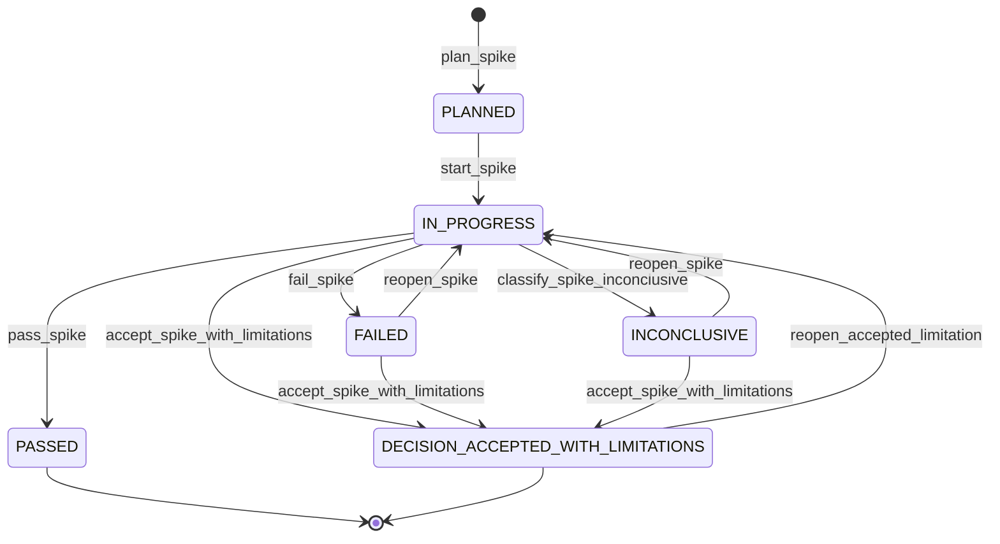
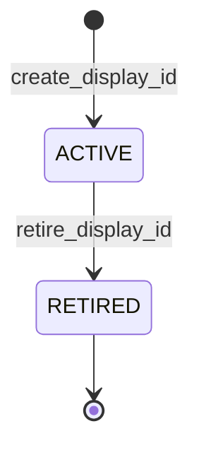
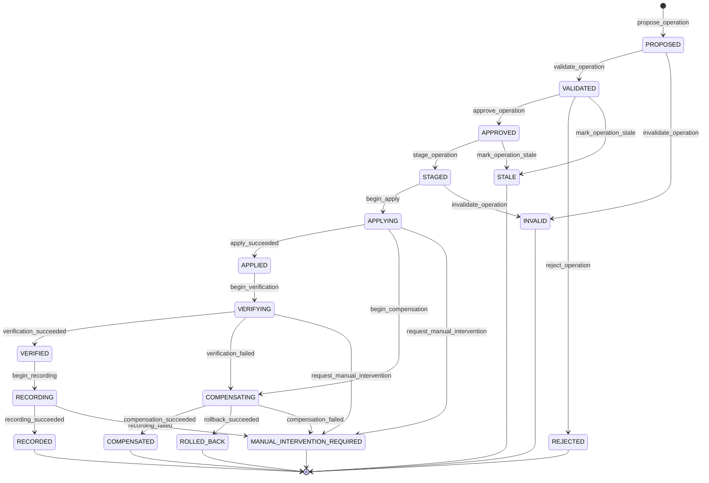

# Corte -1.2: contratos de ejecucion y cierre

## Objetivo

La quinta revision cierra el producto nuevo `1.0.0`, Node.js 20+, UUIDv7, display IDs deterministas e inmutables, parent inmutable, permisos restringidos y la validacion externa del Corte -1.2. Este documento convierte los contratos en evidencia verificable que debe quedar cerrada por los spikes.

Regla:

```text
documentar un spike != resolver el problema
```

El Corte -1.2 solo puede cerrarse con decisiones, prototipos, fixtures, pruebas automatizadas, evidencia y ADRs.

## 1. Gating del roadmap

El vertical slice productivo queda bloqueado hasta cerrar:

```text
Corte -1
Corte -1.1
Corte -1.2
```

No avanzar a Corte 0 si existe un spike con estado:

```text
PLANNED
IN_PROGRESS
FAILED
INCONCLUSIVE
```

Estados que permiten cierre:

```text
PASSED
DECISION_ACCEPTED_WITH_LIMITATIONS
```



| Evento | Transicion | Motivo o guard |
|--------|------------|----------------|
| `plan_spike` | inicial -> `PLANNED` | La hipotesis, alcance, timebox y criterios quedan definidos. |
| `start_spike` | `PLANNED` -> `IN_PROGRESS` | Se inicia el prototipo dentro del timebox aprobado. |
| `pass_spike` | `IN_PROGRESS` -> `PASSED` | La evidencia cumple los criterios de aprobacion. |
| `fail_spike` | `IN_PROGRESS` -> `FAILED` | La hipotesis falla o un criterio obligatorio no se cumple. |
| `classify_spike_inconclusive` | `IN_PROGRESS` -> `INCONCLUSIVE` | La evidencia no permite una decision confiable. |
| `reopen_spike` | `FAILED` o `INCONCLUSIVE` -> `IN_PROGRESS` | Se autoriza un nuevo intento con alcance o mitigacion revisados. |
| `accept_spike_with_limitations` | `IN_PROGRESS`, `FAILED` o `INCONCLUSIVE` -> `DECISION_ACCEPTED_WITH_LIMITATIONS` | Solo si todos los criterios fallidos son `critical: false` o `waivable: true`; requiere ADR. |
| `reopen_accepted_limitation` | `DECISION_ACCEPTED_WITH_LIMITATIONS` -> `IN_PROGRESS` | Se cumple la condicion de reapertura registrada en el ADR. |

`DECISION_ACCEPTED_WITH_LIMITATIONS` exige ADR con alcance de la limitacion, riesgo aceptado, mitigacion, owner y condicion de reapertura. No puede utilizarse si falla un criterio `critical` con `waivable: false`.

## 2. Producto, naming y versionado

La decision de producto esta cerrada:

```yaml
plugin:
  version: 1.0.0
  schema_version: 1
  template_pack:
    version: 1.0.0
```

El plugin actual 3.x queda en maintenance only. El producto next-generation se implementa como producto nuevo `1.0.0`, con namespace, manifest, marketplace, instalacion y sitio propios.

Naming gate minimo:

- GitHub;
- npm;
- PyPI;
- crates.io;
- Homebrew;
- Chocolatey;
- dominios;
- marketplaces;
- buscadores;
- nombres de paquetes;
- nombres de binarios;
- marcas o productos relevantes.

## 3. API conversacional, launcher interno y CLI externa

Separar tres capas:

| Capa | Forma | Contrato |
|------|-------|----------|
| API conversacional | `/<plugin-name>:<skill-name>` | Interfaz de usuario dentro de Claude Code. |
| Launcher interno estable del plugin | `<product-cli>` | Entrada que las skills invocan via Bash cuando el plugin esta habilitado. |
| CLI externa opcional | `<product-cli>` instalado fuera del plugin | Solo existe si se distribuye por npm, Homebrew, binario o instalador. |

No describir el launcher interno como interfaz externa. El launcher en `bin/` puede estar disponible en el PATH del Bash tool del plugin sin estar instalado globalmente para usuario, CI u otros agentes.

El runtime definitivo es un bundle JavaScript self-contained con Node.js 20+ obligatorio. El preflight debe validar presencia, version minima, permisos, plugin root, PATH, mensaje de instalacion y salida JSON estructurada para skills.

## 4. Contrato de ejecucion de skills

Cada `SKILL.md` v4 debe declarar frontmatter compatible con Claude Code:

```yaml
---
description: ...
argument-hint: ...
disable-model-invocation: true
---
```

Contrato de preaprobacion:

```yaml
# check/SKILL.md
allowed-tools: Bash(<product-cli> check *)

# report/SKILL.md, solo stages query-only
allowed-tools: Bash(<product-cli> report status *) Bash(<product-cli> report standup *) Bash(<product-cli> report history *)
```

Las skills mutantes `init`, `config`, `release`, `item`, `task`, `decision` y
`update` no declaran `allowed-tools` general. Ninguna skill preaprueba
`approve`, `apply` o deployment.

## 4.1. Proteccion de `.planning/**`

El plugin distribuye `hooks/hooks.json` con un hook `PreToolUse` para `Write`,
`Edit` y `Bash`, implementado por `scripts/protect-planning-state.mjs`.

Reglas:

- `Write` y `Edit` se deniegan cuando el target esta dentro de
  `<workspace>/.planning/**`, incluso mediante path absoluto, `../` o symlink.
- `Bash` se deniega cuando el comando puede escribir en `.planning/**` mediante
  redirect, `tee`, `cp`, `mv`, `rm`, shells anidados, `python`, `node` u otro
  script mutante.
- Solo el launcher aprobado `<product-cli>` puede mutar `.planning/**`.
- Read, Glob, Grep, Bash query-only y comandos query-only del launcher quedan
  permitidos.

Mensaje exacto:

```text
Direct writes to .planning/** are prohibited.
Use <product-cli> to produce and apply a ChangeSet.
```

Los tests obligatorios viven en
`hooks/tests/protect-planning-state.test.mjs` y cubren `write-direct-file`,
`edit-direct-file`, `bash-redirect`, `bash-tee`, `bash-cp`, `bash-mv`,
`bash-rm`, `symlink-escape`, `launcher-allowed` y `read-allowed`.

Campos obligatorios en el cuerpo:

- intencion;
- argumentos;
- precondiciones;
- launcher;
- herramientas;
- comandos permitidos;
- aprobaciones;
- stop conditions;
- manejo de error;
- salida esperada.

Politica por stage:

| Stage u operacion | Preaprobacion de host | Aprobacion runtime |
|-------------------|-----------------------|--------------------|
| `check` | permitida | no aplica si no muta |
| `status` | permitida | no aplica si no muta |
| `inspect` | permitida | no aplica si no muta |
| `propose` | permitida | no aplica hasta generar ChangeSet |
| `validate` | permitida | no aplica hasta aprobar |
| `approve` | no preaprobada | requiere humano o policy explicita |
| `apply` | no preaprobada por defecto | requiere approval vinculada al hash |
| Git mutante | segun policy | requiere ChangeSet o aprobacion explicita |
| deployment | no preaprobado | requiere aprobacion explicita |

Separar permisos del host y aprobaciones runtime:

- Host permissions controlan si Claude puede ejecutar herramientas.
- Runtime approval controla si un ChangeSet especifico puede aplicarse.

Politica base:

```yaml
approvals:
  allow_agent_self_approval: false
```

Una skill no debe aprobar su propio ChangeSet, ocultar cambios, ejecutar `apply` sin policy, saltar checks ni modificar `.planning/` directamente.

## 5. Limites de agregados

Agregados canonicos:

```text
ProjectContext Aggregate
Scope Aggregate
Release Aggregate
ReleaseItem Aggregate
WorkPackage Aggregate
Task Aggregate
```

Invariantes locales, con consistencia fuerte:

- schema valido;
- transicion permitida;
- scope valido;
- campos condicionales;
- gates propios;
- estado local.

Invariantes transversales, recomputables:

- readiness de Release;
- completion agregada;
- dependencias satisfechas;
- grafo sin ciclos;
- work packages obligatorios completados;
- gates transversales aprobados.

Operaciones multiagregado declaran:

- agregados leidos;
- agregados mutados;
- revisiones base;
- orden de escritura;
- compensacion;
- postcondiciones;
- riesgo de conflicto.

Los hijos referencian al padre. Los padres no mantienen listas canonicas de hijos; los indices son proyecciones regenerables.

Relaciones inmutables en 1.0:

```text
ReleaseItem.release_id        immutable
WorkPackage.release_item_id   immutable
Task.work_package_id          immutable
```

No existe `move/edit`. Para trasladar trabajo se crea un nuevo agregado bajo
el nuevo padre, se registra provenance y se marca el anterior como
`SUPERSEDED` o `CANCELLED` con `replacement_id`.

## 6. Lifecycle de display IDs

Los IDs primarios son la identidad real. `display_id` es una entrada humana resoluble.

Modelo:

```yaml
id: 0190f1c8-4e39-7a21-8bb2-2a45f8154ef1
display_id: RI-4F8Q2B7X
display_id_status: ACTIVE
```

Estados:

```text
ACTIVE
RETIRED
```



| Evento | Transicion | Motivo o guard |
|--------|------------|----------------|
| `create_display_id` | inicial -> `ACTIVE` | El display ID se deriva del UUIDv7 y se persiste al crear el agregado. |
| `retire_display_id` | `ACTIVE` -> `RETIRED` | El agregado se retira y su display ID no puede reutilizarse. |

Reglas:

- referencias internas siempre usan `id`;
- `display_id` es inmutable desde la creacion;
- no se exige continuidad;
- no se reutilizan IDs retirados o cancelados;
- no existen counters secuenciales ni aliases en 1.0;
- estrategia definitiva: prefijo de agregado y Base32 Crockford de un short-hash del UUIDv7, con ampliacion de longitud ante colision.

El resolver de argumentos debe detectar ambiguedad y pedir seleccion humana, no elegir por heuristica silenciosa.

## 7. DSL v1

Cada guia ejecutable declara:

```yaml
dsl_version: 1
```

Tipos permitidos:

```text
string
number
boolean
null
array
object
date
datetime
```

Field paths usan notacion por punto:

```text
item.kind
item.tags
work_package.contracts.api
```

Operadores:

```text
equals
not_equals
contains
exists
all
any
not
in
matches
```

Semantica:

- no hay coercion implicita;
- campos inexistentes producen error estructurado salvo en `exists`;
- strings son case-sensitive por defecto;
- arrays preservan orden de entrada, pero `contains` e `in` declaran comparacion por igualdad canonica;
- `all` y `any` hacen short-circuit;
- cada evaluacion produce trace estructurado;
- `matches` debe declarar motor regex, timeout, tamano maximo de input/patron y proteccion contra ReDoS.

La DSL debe poder evaluarse sin LLM, sin Markdown, con resultado reproducible y con errores estructurados.

## 8. Canonicalizacion y hashing

Pipeline:

```text
YAML 1.2 seguro
-> objeto validado
-> eliminar campos no semanticos
-> JSON Canonicalization Scheme RFC 8785
-> UTF-8
-> SHA-256
```

Excluir de `content_revision`:

- `revision`;
- `generated_at`;
- `updated_at`;
- render metadata;
- derived status;
- comments;
- presentation-only fields.

Tipos de hash:

```text
content_revision
source_fingerprint
template_fingerprint
operation_hash
change_set_hash
render_hash
tree_hash
```

Reglas:

- rechazar claves duplicadas;
- rechazar custom tags;
- rechazar aliases peligrosos;
- rechazar anchors no permitidos;
- rechazar tipos implicitos ambiguos de YAML 1.1;
- normalizar fechas a UTC RFC 3339 con precision definida;
- definir politica Unicode antes de hashing;
- definir numeros permitidos y rechazar `NaN`, `Infinity` y precision ambigua.

Fingerprints de directorios usan paths normalizados, orden lexicografico, politica de symlinks, exclusiones, interaccion con Git ignore y contenido, implementado como tree hash o manifest Merkle.

## 9. Execution Context y Deployment Environment

Separar:

```text
Execution Context = donde o como se ejecuta una validacion
Deployment Environment = target desplegable
```

Storage:

```text
.planning/execution-contexts/
.planning/environments/
```

Ejemplo:

```yaml
execution_context:
  id: ci
  kind: pipeline
  runner: github-actions

deployment_environment:
  id: beta
  kind: preproduction
  deployment_command: deploy-beta
```

Execution Context cubre commands, runners, setup, teardown y test evidence.

Deployment Environment cubre deployment, promotion, rollback, approvals, secrets refs y smoke verification.

Un test puede ejecutarse en `ci`, apuntar a `beta` y producir evidencia para readiness.

## 10. State machine de operaciones

Transiciones permitidas:

El campo `state` no se puede editar arbitrariamente. Cada cambio debe ser consecuencia de un evento de transicion autorizado, con motivo, actor, precondiciones y evidencia registrados.

Estados definitivos:

```text
PROPOSED
INVALID
VALIDATED
APPROVED
REJECTED
STALE
STAGED
APPLYING
APPLIED
VERIFYING
VERIFIED
RECORDING
RECORDED
COMPENSATING
COMPENSATED
ROLLED_BACK
MANUAL_INTERVENTION_REQUIRED
```



| Evento | Transicion | Motivo o guard |
|--------|------------|----------------|
| `propose_operation` | inicial -> `PROPOSED` | Se crea un ChangeSet con base revisions y alcance declarados. |
| `validate_operation` | `PROPOSED` -> `VALIDATED` | Schemas, boundaries, precondiciones y concurrencia pasan. |
| `invalidate_operation` | `PROPOSED` o `STAGED` -> `INVALID` | Se detecta un error antes de aplicar efectos. |
| `approve_operation` | `VALIDATED` -> `APPROVED` | Un actor autorizado aprueba el ChangeSet vigente. |
| `reject_operation` | `VALIDATED` -> `REJECTED` | Un actor autorizado rechaza la propuesta con motivo registrado. |
| `mark_operation_stale` | `VALIDATED` o `APPROVED` -> `STALE` | Cambia una base revision o una precondicion antes de aplicar. |
| `stage_operation` | `APPROVED` -> `STAGED` | Se preparan snapshots y escrituras sin mutar el estado canonico. |
| `begin_apply` | `STAGED` -> `APPLYING` | Se inicia la mutacion autorizada e idempotente. |
| `apply_succeeded` | `APPLYING` -> `APPLIED` | Todas las escrituras previstas terminan correctamente. |
| `begin_compensation` | `APPLYING` -> `COMPENSATING` | La aplicacion produjo un efecto que requiere recovery. |
| `request_manual_intervention` | `APPLYING` o `VERIFYING` -> `MANUAL_INTERVENTION_REQUIRED` | No existe recovery automatico seguro. |
| `begin_verification` | `APPLIED` -> `VERIFYING` | Las escrituras terminaron y se inicia la comprobacion. |
| `verification_succeeded` | `VERIFYING` -> `VERIFIED` | Postcondiciones, hashes y referencias quedan comprobados. |
| `verification_failed` | `VERIFYING` -> `COMPENSATING` | La operacion tuvo efectos, pero la comprobacion no pasa. |
| `begin_recording` | `VERIFIED` -> `RECORDING` | Se inicia la persistencia de eventos, manifest y proyecciones. |
| `recording_succeeded` | `RECORDING` -> `RECORDED` | La auditoria y las proyecciones quedan registradas. |
| `recording_failed` | `RECORDING` -> `MANUAL_INTERVENTION_REQUIRED` | No se puede garantizar el registro completo automaticamente. |
| `compensation_succeeded` | `COMPENSATING` -> `COMPENSATED` | La compensacion finaliza y su resultado es verificable. |
| `rollback_succeeded` | `COMPENSATING` -> `ROLLED_BACK` | El rollback finaliza y el estado anterior queda verificado. |
| `compensation_failed` | `COMPENSATING` -> `MANUAL_INTERVENTION_REQUIRED` | La compensacion no puede garantizar consistencia automatica. |

Semantica obligatoria:

- `INVALID`: error detectado antes de aplicar efectos.
- `APPLYING`: la operacion ya comenzo a mutar.
- `VERIFYING`: las escrituras terminaron, pero aun no estan aprobadas como validas.
- `VERIFIED`: las postcondiciones y hashes pasaron.
- `RECORDING`: se estan persistiendo eventos, manifest y proyecciones.
- `COMPENSATING`: hubo efectos y se esta ejecutando recovery.
- `MANUAL_INTERVENTION_REQUIRED`: no existe recovery automatico seguro.

Manifest minimo:

```yaml
state: PROPOSED
previous_state: null
transition_reason: created
actor: system
evidence: []
attempt: 1
started_at: 2026-07-22T00:00:00Z
updated_at: 2026-07-22T00:00:00Z
recovery_required: false
manual_action: null
```

El Spike Transaction Recovery debe producir tabla formal, tests de transicion, fault matrix, recovery runbook y ADR.

## 11. Estrategia de spikes

Orden aprobado:

```text
Host integration
-> Runtime distribution
-> Canonical core
-> Worktree merge
-> Transaction recovery
-> Integrated prototype
```

Template obligatorio:

```text
Hypothesis
Scope
Non-goals
Timebox
Prototype location
Reusable or disposable
Inputs
Fault model
Pass criteria
Fail criteria
Evidence
Decision record
Result
```

Cada spike debe producir codigo, fixtures, pruebas, evidencia, ADR y decision.

## 12. Criterio de aprobacion del runtime

El runtime productivo puede comenzar solo cuando:

- naming este decidido;
- namespace este demostrado;
- runtime este seleccionado;
- paths esten probados;
- merge protocol pase fixtures;
- hashing sea reproducible;
- DSL sea ejecutable;
- recovery este demostrado;
- Operation state machine este cerrada;
- producto y version esten decididos;
- exista prototipo integrado.

## 13. Fuentes tecnicas usadas

- Claude Code Skills: `https://code.claude.com/docs/es/skills`
- Claude Code Plugins reference: `https://code.claude.com/docs/en/plugins-reference`
- RFC 8785 JSON Canonicalization Scheme: `https://www.rfc-editor.org/rfc/rfc8785.html`
- RFC 9562 UUIDs: `https://www.rfc-editor.org/info/rfc9562/`
