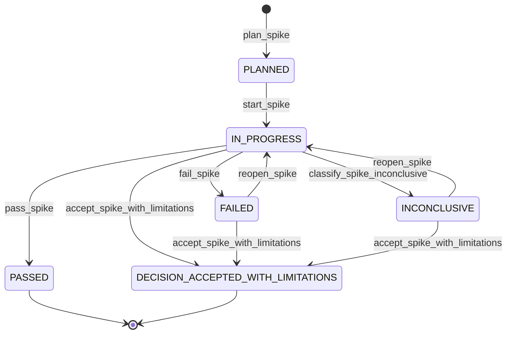
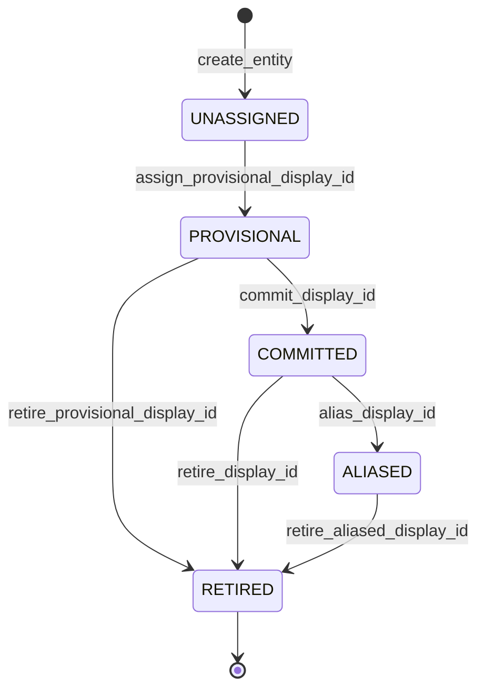
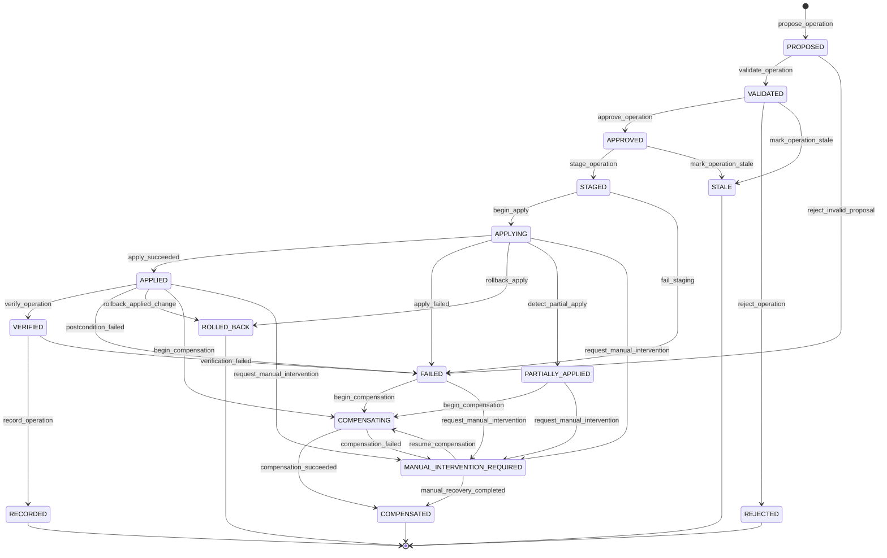

# Corte -1.2: contratos de ejecucion y cierre

## Objetivo

La cuarta revision aprueba ejecutar el Corte -1.2, pero no aprueba naming, version, runtime productivo ni publicacion. Este documento convierte los problemas residuales en contratos verificables que deben quedar cerrados por los spikes.

Regla:

```text
documentar un spike != resolver el problema
```

El Corte -1.2 solo puede cerrarse con decisiones, prototipos, fixtures, pruebas automatizadas, evidencia y ADRs.

## 1. Gating del roadmap

El vertical slice productivo queda bloqueado hasta cerrar:

```text
Corte -1
Corte -1.1
Corte -1.2
```

No avanzar a Corte 0 si existe un spike con estado:

```text
PLANNED
IN_PROGRESS
FAILED
INCONCLUSIVE
```

Estados que permiten cierre:

```text
PASSED
DECISION_ACCEPTED_WITH_LIMITATIONS
```



| Evento | Transicion | Motivo o guard |
|--------|------------|----------------|
| `plan_spike` | inicial -> `PLANNED` | La hipotesis, alcance, timebox y criterios quedan definidos. |
| `start_spike` | `PLANNED` -> `IN_PROGRESS` | Se inicia el prototipo dentro del timebox aprobado. |
| `pass_spike` | `IN_PROGRESS` -> `PASSED` | La evidencia cumple los criterios de aprobacion. |
| `fail_spike` | `IN_PROGRESS` -> `FAILED` | La hipotesis falla o un criterio obligatorio no se cumple. |
| `classify_spike_inconclusive` | `IN_PROGRESS` -> `INCONCLUSIVE` | La evidencia no permite una decision confiable. |
| `reopen_spike` | `FAILED` o `INCONCLUSIVE` -> `IN_PROGRESS` | Se autoriza un nuevo intento con alcance o mitigacion revisados. |
| `accept_spike_with_limitations` | `IN_PROGRESS`, `FAILED` o `INCONCLUSIVE` -> `DECISION_ACCEPTED_WITH_LIMITATIONS` | Existe ADR con riesgo, limitacion, owner y condicion de reapertura. |

`DECISION_ACCEPTED_WITH_LIMITATIONS` exige ADR con alcance de la limitacion, riesgo aceptado, mitigacion, owner y condicion de reapertura.

## 2. Producto, naming y versionado

La documentacion debe mantener abierta la decision hasta cerrar naming gate:

```yaml
plugin:
  version: <product-version>
  schema_version: <schema-version>
  template_pack:
    version: <template-pack-version>
```

Opciones:

| Opcion | Version inicial | Impacto |
|--------|-----------------|---------|
| Continuidad del plugin actual | `<product-version>` | Mantiene repo, marketplace y upgrade path, pero requiere ruptura major clara. |
| Producto nuevo | `1.0.0` | Requiere namespace, manifest, marketplace, instalacion, sitio y migracion separados. |

No modificar definitivamente manifests, binarios, package names, marketplace, sitio ni documentacion publica final hasta decidir producto y nombre.

Naming gate minimo:

- GitHub;
- npm;
- PyPI;
- crates.io;
- Homebrew;
- Chocolatey;
- dominios;
- marketplaces;
- buscadores;
- nombres de paquetes;
- nombres de binarios;
- marcas o productos relevantes.

## 3. API conversacional, launcher interno y CLI externa

Separar tres capas:

| Capa | Forma | Contrato |
|------|-------|----------|
| API conversacional | `/<plugin-name>:<skill-name>` | Interfaz de usuario dentro de Claude Code. |
| Launcher interno estable del plugin | `<product-cli>` | Entrada que las skills invocan via Bash cuando el plugin esta habilitado. |
| CLI externa opcional | `<product-cli>` instalado fuera del plugin | Solo existe si se distribuye por npm, Homebrew, binario o instalador. |

No describir el launcher interno como interfaz externa. El launcher en `bin/` puede estar disponible en el PATH del Bash tool del plugin sin estar instalado globalmente para usuario, CI u otros agentes.

El spike de runtime debe decidir entre:

```text
bundle JavaScript + Node.js 20+ obligatorio
binario nativo
instalacion administrada
```

Si se elige Node obligatorio, el preflight debe validar presencia, version minima, permisos, plugin root, PATH, mensaje de instalacion y salida JSON estructurada para skills.

## 4. Contrato de ejecucion de skills

Cada `SKILL.md` v4 debe declarar frontmatter compatible con Claude Code:

```yaml
---
description: ...
argument-hint: ...
disable-model-invocation: true
allowed-tools: Bash(<product-cli> ...)
---
```

Campos obligatorios en el cuerpo:

- intencion;
- argumentos;
- precondiciones;
- launcher;
- herramientas;
- comandos permitidos;
- aprobaciones;
- stop conditions;
- manejo de error;
- salida esperada.

Politica por stage:

| Stage u operacion | Preaprobacion de host | Aprobacion runtime |
|-------------------|-----------------------|--------------------|
| `check` | permitida | no aplica si no muta |
| `status` | permitida | no aplica si no muta |
| `inspect` | permitida | no aplica si no muta |
| `propose` | permitida | no aplica hasta generar ChangeSet |
| `validate` | permitida | no aplica hasta aprobar |
| `approve` | no preaprobada | requiere humano o policy explicita |
| `apply` | no preaprobada por defecto | requiere approval vinculada al hash |
| Git mutante | segun policy | requiere ChangeSet o aprobacion explicita |
| deployment | no preaprobado | requiere aprobacion explicita |

Separar permisos del host y aprobaciones runtime:

- Host permissions controlan si Claude puede ejecutar herramientas.
- Runtime approval controla si un ChangeSet especifico puede aplicarse.

Politica base:

```yaml
approvals:
  allow_agent_self_approval: false
```

Una skill no debe aprobar su propio ChangeSet, ocultar cambios, ejecutar `apply` sin policy, saltar checks ni modificar `.planning/` directamente.

## 5. Limites de agregados

Agregados canonicos:

```text
ProjectContext Aggregate
Scope Aggregate
Release Aggregate
ReleaseItem Aggregate
WorkPackage Aggregate
Task Aggregate
```

Invariantes locales, con consistencia fuerte:

- schema valido;
- transicion permitida;
- scope valido;
- campos condicionales;
- gates propios;
- estado local.

Invariantes transversales, recomputables:

- readiness de Release;
- completion agregada;
- dependencias satisfechas;
- grafo sin ciclos;
- work packages obligatorios completados;
- gates transversales aprobados.

Operaciones multiagregado declaran:

- agregados leidos;
- agregados mutados;
- revisiones base;
- orden de escritura;
- compensacion;
- postcondiciones;
- riesgo de conflicto.

Los hijos referencian al padre. Los padres no mantienen listas canonicas de hijos; los indices son proyecciones regenerables.

## 6. Lifecycle de display IDs

Los IDs primarios son la identidad real. `display_id` es una entrada humana resoluble.

Modelo:

```yaml
id: 019...
display_id: RI-7H3K9
display_id_status: COMMITTED
aliases:
  - RI0038
```

Estados:

```text
UNASSIGNED
PROVISIONAL
COMMITTED
ALIASED
RETIRED
```



| Evento | Transicion | Motivo o guard |
|--------|------------|----------------|
| `create_entity` | inicial -> `UNASSIGNED` | Se crea el agregado sin etiqueta humana asignada. |
| `assign_provisional_display_id` | `UNASSIGNED` -> `PROVISIONAL` | Se genera una etiqueta candidata antes de confirmar su unicidad. |
| `commit_display_id` | `PROVISIONAL` -> `COMMITTED` | La colision se descarta y la etiqueta queda persistida para el agregado. |
| `retire_provisional_display_id` | `PROVISIONAL` -> `RETIRED` | Se abandona el agregado antes de confirmar su etiqueta. |
| `alias_display_id` | `COMMITTED` -> `ALIASED` | Cambia la etiqueta visible; la anterior se conserva como alias. |
| `retire_display_id` | `COMMITTED` -> `RETIRED` | El agregado se retira y su etiqueta no puede reutilizarse. |
| `retire_aliased_display_id` | `ALIASED` -> `RETIRED` | Se retira un agregado que conserva historial de aliases. |

Reglas:

- referencias internas siempre usan `id`;
- `display_id` puede cambiar y conservar aliases;
- no se exige continuidad;
- no se reutilizan IDs retirados o cancelados;
- counters secuenciales quedan fuera del primer runtime si no pasan fixtures de merge;
- estrategia inicial recomendada: ID humano derivado del primary ID, por ejemplo `RI-7H3K9`.

El resolver de argumentos debe detectar ambiguedad y pedir seleccion humana, no elegir por heuristica silenciosa.

## 7. DSL v1

Cada guia ejecutable declara:

```yaml
dsl_version: 1
```

Tipos permitidos:

```text
string
number
boolean
null
array
object
date
datetime
```

Field paths usan notacion por punto:

```text
item.kind
item.tags
work_package.contracts.api
```

Operadores:

```text
equals
not_equals
contains
exists
all
any
not
in
matches
```

Semantica:

- no hay coercion implicita;
- campos inexistentes producen error estructurado salvo en `exists`;
- strings son case-sensitive por defecto;
- arrays preservan orden de entrada, pero `contains` e `in` declaran comparacion por igualdad canonica;
- `all` y `any` hacen short-circuit;
- cada evaluacion produce trace estructurado;
- `matches` debe declarar motor regex, timeout, tamano maximo de input/patron y proteccion contra ReDoS.

La DSL debe poder evaluarse sin LLM, sin Markdown, con resultado reproducible y con errores estructurados.

## 8. Canonicalizacion y hashing

Pipeline:

```text
YAML 1.2 seguro
-> objeto validado
-> eliminar campos no semanticos
-> JSON Canonicalization Scheme RFC 8785
-> UTF-8
-> SHA-256
```

Excluir de `content_revision`:

- `revision`;
- `generated_at`;
- `updated_at`;
- render metadata;
- derived status;
- comments;
- presentation-only fields.

Tipos de hash:

```text
content_revision
source_fingerprint
template_fingerprint
operation_hash
change_set_hash
render_hash
tree_hash
```

Reglas:

- rechazar claves duplicadas;
- rechazar custom tags;
- rechazar aliases peligrosos;
- rechazar anchors no permitidos;
- rechazar tipos implicitos ambiguos de YAML 1.1;
- normalizar fechas a UTC RFC 3339 con precision definida;
- definir politica Unicode antes de hashing;
- definir numeros permitidos y rechazar `NaN`, `Infinity` y precision ambigua.

Fingerprints de directorios usan paths normalizados, orden lexicografico, politica de symlinks, exclusiones, interaccion con Git ignore y contenido, implementado como tree hash o manifest Merkle.

## 9. Execution Context y Deployment Environment

Separar:

```text
Execution Context = donde o como se ejecuta una validacion
Deployment Environment = target desplegable
```

Storage:

```text
.planning/execution-contexts/
.planning/environments/
```

Ejemplo:

```yaml
execution_context:
  id: ci
  kind: pipeline
  runner: github-actions

deployment_environment:
  id: beta
  kind: preproduction
  deployment_command: deploy-beta
```

Execution Context cubre commands, runners, setup, teardown y test evidence.

Deployment Environment cubre deployment, promotion, rollback, approvals, secrets refs y smoke verification.

Un test puede ejecutarse en `ci`, apuntar a `beta` y producir evidencia para readiness.

## 10. State machine de operaciones

Transiciones permitidas:

El campo `state` no se puede editar arbitrariamente. Cada cambio debe ser consecuencia de un evento de transicion autorizado, con motivo, actor, precondiciones y evidencia registrados.



| Evento | Transicion | Motivo o guard |
|--------|------------|----------------|
| `propose_operation` | inicial -> `PROPOSED` | Se crea un ChangeSet con base revisions y alcance declarados. |
| `validate_operation` | `PROPOSED` -> `VALIDATED` | Schemas, boundaries, precondiciones y concurrencia pasan. |
| `reject_invalid_proposal` | `PROPOSED` -> `FAILED` | La propuesta no puede validarse por error estructural o de dominio. |
| `approve_operation` | `VALIDATED` -> `APPROVED` | Un actor autorizado aprueba el ChangeSet vigente. |
| `reject_operation` | `VALIDATED` -> `REJECTED` | Un actor autorizado rechaza la propuesta con motivo registrado. |
| `mark_operation_stale` | `VALIDATED` o `APPROVED` -> `STALE` | Cambia una base revision o una precondicion antes de aplicar. |
| `stage_operation` | `APPROVED` -> `STAGED` | Se preparan snapshots y escrituras sin mutar el estado canonico. |
| `fail_staging` | `STAGED` -> `FAILED` | No se puede completar staging o snapshot. |
| `begin_apply` | `STAGED` -> `APPLYING` | Se inicia la mutacion autorizada e idempotente. |
| `apply_succeeded` | `APPLYING` -> `APPLIED` | Todas las escrituras previstas terminan correctamente. |
| `apply_failed` | `APPLYING` -> `FAILED` | La mutacion falla antes de completar el ChangeSet. |
| `detect_partial_apply` | `APPLYING` -> `PARTIALLY_APPLIED` | Algunas escrituras terminaron y otras no. |
| `rollback_apply` | `APPLYING` -> `ROLLED_BACK` | El rollback de staging o de la mutacion es verificable. |
| `request_manual_intervention` | `APPLYING`, `APPLIED`, `PARTIALLY_APPLIED` o `FAILED` -> `MANUAL_INTERVENTION_REQUIRED` | Recovery automatico no es seguro o no es posible. |
| `begin_compensation` | `PARTIALLY_APPLIED` -> `COMPENSATING` | Se inicia recovery despues de una aplicacion parcial. |
| `verify_operation` | `APPLIED` -> `VERIFIED` | Postcondiciones, hashes y referencias quedan comprobados. |
| `postcondition_failed` | `APPLIED` -> `FAILED` | La escritura termino pero el estado resultante no cumple. |
| `rollback_applied_change` | `APPLIED` -> `ROLLED_BACK` | La compensacion reversible se completo y fue verificada. |
| `begin_compensation` | `APPLIED` o `FAILED` -> `COMPENSATING` | Se inicia recovery para reparar una mutacion incompleta o invalida. |
| `verification_failed` | `VERIFIED` -> `FAILED` | La verificacion posterior o el registro de evidencia falla. |
| `record_operation` | `VERIFIED` -> `RECORDED` | Evento, manifest y proyecciones quedan registrados. |
| `compensation_succeeded` | `COMPENSATING` -> `COMPENSATED` | La compensacion finaliza y su resultado es verificable. |
| `compensation_failed` | `COMPENSATING` -> `MANUAL_INTERVENTION_REQUIRED` | La compensacion no puede garantizar consistencia automatica. |
| `resume_compensation` | `MANUAL_INTERVENTION_REQUIRED` -> `COMPENSATING` | Un operador aporta la accion requerida y autoriza continuar el recovery. |
| `manual_recovery_completed` | `MANUAL_INTERVENTION_REQUIRED` -> `COMPENSATED` | La intervencion manual corrige el estado y deja evidencia verificable. |

Manifest minimo:

```yaml
state: PROPOSED
previous_state: null
transition_reason: created
attempt: 1
started_at: 2026-07-22T00:00:00Z
updated_at: 2026-07-22T00:00:00Z
recovery_required: false
manual_action: null
```

El Spike Transaction Recovery debe producir tabla formal, tests de transicion, fault matrix, recovery runbook y ADR.

## 11. Estrategia de spikes

Orden aprobado:

```text
Host integration
-> Runtime distribution
-> Canonical core
-> Worktree merge
-> Transaction recovery
-> Integrated prototype
```

Template obligatorio:

```text
Hypothesis
Scope
Non-goals
Timebox
Prototype location
Reusable or disposable
Inputs
Fault model
Pass criteria
Fail criteria
Evidence
Decision record
Result
```

Cada spike debe producir codigo, fixtures, pruebas, evidencia, ADR y decision.

## 12. Criterio de aprobacion del runtime

El runtime productivo puede comenzar solo cuando:

- naming este decidido;
- namespace este demostrado;
- runtime este seleccionado;
- paths esten probados;
- merge protocol pase fixtures;
- hashing sea reproducible;
- DSL sea ejecutable;
- recovery este demostrado;
- Operation state machine este cerrada;
- producto y version esten decididos;
- exista prototipo integrado.

## 13. Fuentes tecnicas usadas

- Claude Code Skills: `https://code.claude.com/docs/es/skills`
- Claude Code Plugins reference: `https://code.claude.com/docs/en/plugins-reference`
- RFC 8785 JSON Canonicalization Scheme: `https://www.rfc-editor.org/rfc/rfc8785.html`
- RFC 9562 UUIDs: `https://www.rfc-editor.org/info/rfc9562/`
