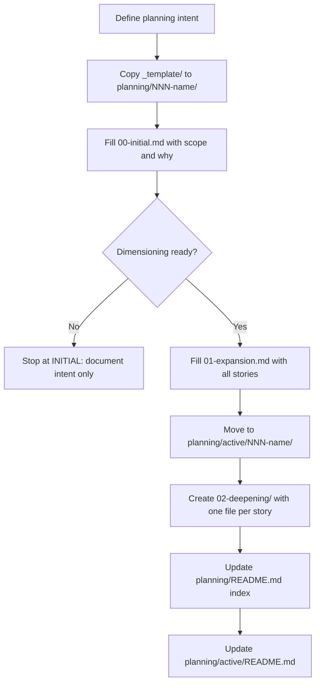

# CREATE-PLANNING

> [← README](README.md)

Creates a new planning from scratch. Used when a new body of work needs to be tracked that is not covered by any existing active planning.

---

---

## Steps

0. Use the current directory's planning workspace only. The active planning root is `./.planning/`; never search parent directories for another `.planning/`.
1. Define the intent of the planning in a short statement (what + why).
2. Copy `.planning/_template/` to `.planning/NNN-name/`.
3. Fill `00-initial.md` — captures purpose, approximate scope, and initiator.
4. If there is enough clarity:
   - Fill `01-expansion.md` — list all user stories and dependencies.
   - **Monorepo child split:** If this is a parent workspace and the planning affects child artifact directories that have their own `.planning/`, create linked child plannings in those child workspaces. The parent planning keeps coordination and parent-scope work only; child implementation belongs to the child planning.
   - **Consult `.planning/TRACEABILITY-GLOBAL.md` → Consolidated Residuals.** For each row with `Status = OPEN`, verify whether its `Source Planning` or `Notes` fields mention areas or terms that overlap with the intent of this planning. If they match, include the residual as a task in the corresponding deepening story and update the residual's `Status` to `ABSORBED` and its `Notes` to reference this planning's ID.
   - Move folder to `.planning/active/NNN-name/`.
   - Create `02-deepening/story-NN-name.md` for each story (incorporating any absorbed residuals as tasks).
5. If not enough clarity: stop at INITIAL. Return to CREATE-PLANNING later.
6. Update `.planning/README.md` (INITIAL table or active link).
7. Update `.planning/active/README.md` index.

---

> [← README](README.md)
