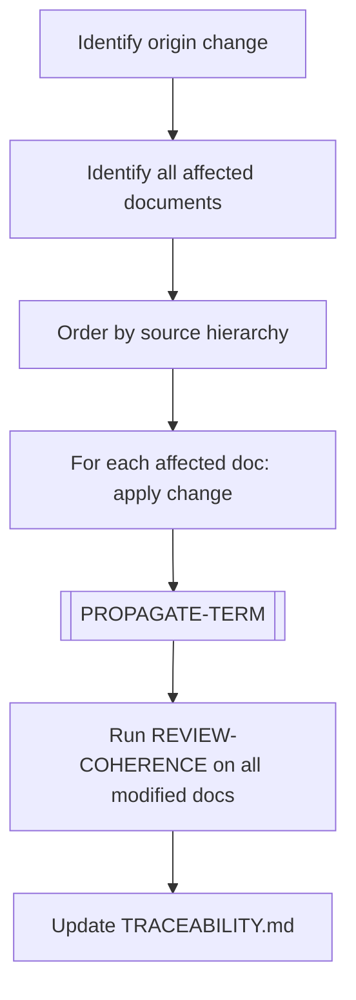

# CASCADE-CHANGE

> [← README](README.md)

Executes a change that originated in one document but must be propagated to many other documents to maintain consistency.

---

---

## Steps

1. Identify the original change (e.g., a term was renamed, a section was restructured).
2. Use grep to find all documents referencing the changed element.
3. Order affected documents by **source hierarchy** (see `GUIDE.md`) — most authoritative first.
4. Before applying changes, decide whether the cascade expresses a cross-cutting decision:
   - If yes and the decision is accepted or forced by source hierarchy, invoke `/plan-decision` to create or update the PDR.
   - If it is only a candidate, record the candidate in `TRACEABILITY.md` or `RETROSPECTIVE-RAW.md` and suggest `/plan-decision`.
5. Apply the change to each document in order.
6. Execute `[PROPAGATE-TERM]` if a term was renamed or redefined.
7. Execute `REVIEW-COHERENCE` on all modified files.
8. Update `TRACEABILITY.md` to document the cascade scope and any PDR created.

---

**Sub-workflows used:** [`[PROPAGATE-TERM]`](../04-SUB-WORKFLOWS/PROPAGATE-TERM.md) · [`[RESOLVE-CONFLICT]`](../04-SUB-WORKFLOWS/RESOLVE-CONFLICT.md)

**Leads to:** [`REVIEW-COHERENCE`](../02-EXECUTION-WORKFLOWS/REVIEW-COHERENCE.md)

---

> [← README](README.md)
