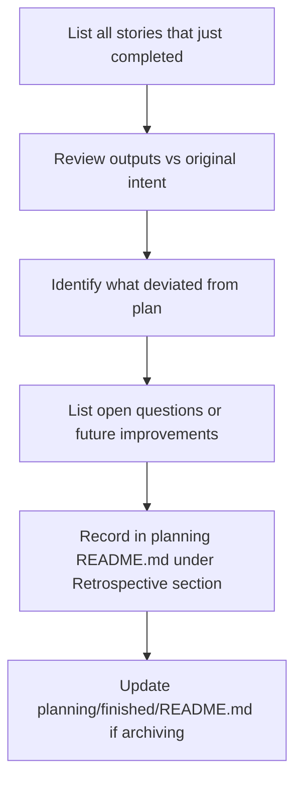

# MILESTONE-FEEDBACK

> [← README](README.md)

Reviews a completed story or planning milestone to capture what went well, what didn't, and what should carry forward to the next planning.

---

---

## Steps

1. List all stories that reached `DONE` in this milestone.
2. Compare outputs against the original intent in `00-initial.md` and `01-expansion.md`.
3. Identify deviations: scope creep, unsolved residuals, decisions made on-the-fly.
4. Read `RETROSPECTIVE-RAW.md` and include any blockers, corrections, skipped work, retries, rollbacks, validation findings, or manual edge cases.
5. Document: what worked well, what didn't, open improvements.
6. Complete the `## Retrospective` section in the planning's `README.md`; add the section first if the planning was created from an older template.
7. If archiving: update `planning/finished/README.md` with the key outputs.

---

**Called by:** [`ADVANCE-PLANNING`](../01-PLANNING-WORKFLOWS/ADVANCE-PLANNING.md) · [`AUDIT-PLANNING`](AUDIT-PLANNING.md)

---

> [← README](README.md)
