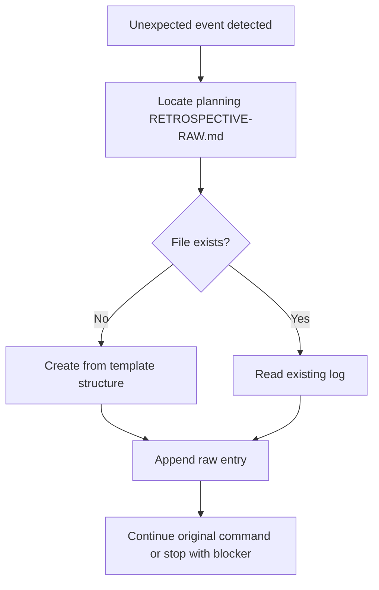

# RECORD-EDGE-CASE

> [← README](README.md)

Records unexpected, corrective, risky, or non-linear events while a planning is being executed. These raw notes feed the final retrospective.

---



---

## When To Record

Record an edge case when any command observes one of these:

- A story, task, validation, smoke test, git operation, or archive check is blocked.
- The user requests corrections after review.
- Scope changes, a story is skipped, split, merged, rolled back, or retried.
- A command creates recovery work that was not part of the original path.
- A warning or failure should inform future planning decisions.
- An unexpected event reveals a possible cross-cutting decision.

Do not record normal progress, successful routine checks, or duplicate entries.

---

## Entry Format

Append a new entry under `## Log`, newest first:

```md
### YYYY-MM-DD HH:MM - <short title>

- **Source:** <command name or manual>
- **Related story/task:** <story-NN, task-NN, or none>
- **What happened:** <fact-based description>
- **Expected instead:** <what the plan or command expected>
- **Resolution:** <how it was fixed, deferred, or contained>
- **Retrospective signal:** <lesson, risk, follow-up, or decision candidate>
```

If some fields are unknown, write `unknown` rather than inventing details.

## PDR Follow-up

If the edge-case entry contains an explicit accepted decision that affects multiple stories, repository areas, shared terminology, planning policy, or future plannings, invoke `/plan-decision` after writing the raw note. If it is only a signal, lesson, open question, or candidate, leave it as `Retrospective signal: decision candidate` and suggest `/plan-decision` in the report.

---

**Called by:** execution, validation, recovery, and archive commands when non-linear events occur.

---

> [← README](README.md)
