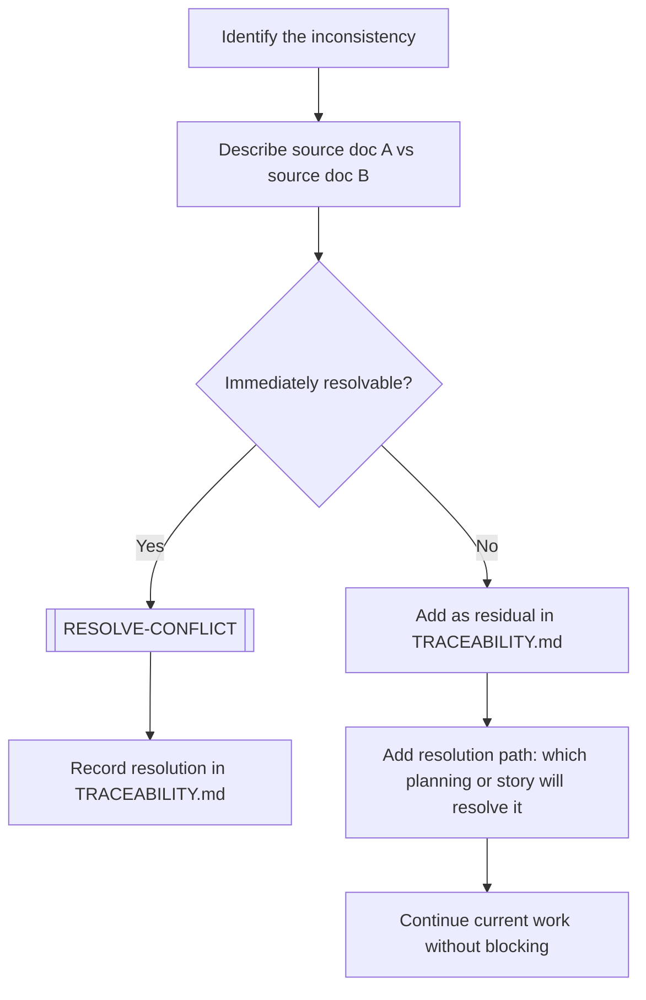

# RECORD-INCONSISTENCY

> [← README](README.md)

Documents a detected contradiction, gap, or ambiguity between two or more documents. Does not resolve it — only records it properly.

---

---

## Steps

1. Clearly describe the inconsistency: what contradicts what, in which files.
2. Determine if it can be resolved immediately (within this story).
3. If yes: execute `[RESOLVE-CONFLICT]` and record the resolution.
   - If the resolution establishes a durable rule affecting multiple stories, areas, shared terminology, or future plannings, invoke `/plan-decision` to create or update an accepted PDR.
4. If no: add as a **residual** in `TRACEABILITY.md`:
   - Note source doc A vs source doc B.
   - Note the expected resolution path (future planning, story, PDR).
   - If the residual is a candidate cross-cutting decision, suggest `/plan-decision` but do not create the PDR until the decision is accepted.
5. Continue current work — residuals do not block progress.

---

**Sub-workflows used:** [`[RESOLVE-CONFLICT]`](../04-SUB-WORKFLOWS/RESOLVE-CONFLICT.md)

---

> [← README](README.md)
