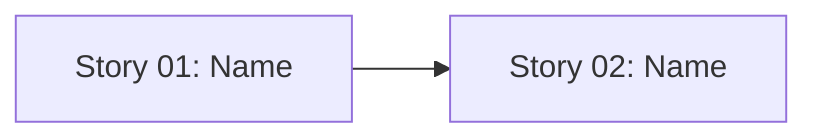

# 🚀 EXPANSION: [Planning Name]

> **Status:** Expansion
> [← planning/README.md](../../README.md)

---

## Story Summary

Use one row per independently valuable story. The story name should describe the outcome, not the implementation detail.

Example rows to model, not to keep:

```md
| 01 | reset-token-api | AP | — | M | GH-123 | TODO |
| 02 | reset-password-screen | WB | 01 | L | GH-124 | TODO |
```

| # | Story | SDLC Phase(s) | Depends On | Risk | External Issue | Status |
|---|-------|--------------|------------|------|----------------|--------|
| 01 | [story name, e.g. reset-token-api] | [area code, e.g. AP] | — | M | [GH-123 or —] | TODO |
| 02 | [story name, e.g. reset-password-screen] | [area code, e.g. WB] | 01 | L | [GH-124 or —] | TODO |

---

## Dependency Map



---

## Impact per Repository Area

Mark each affected area and describe the expected change. Use `N/A` for areas that are intentionally out of scope.

Example: `AP | api/ | ☑ | Add token lifecycle endpoints and persistence`.

| Code | Area | Affected? | What changes |
|------|------|----------|-------------|
| DO | `docs/` | ☐ | [Documentation change or N/A] |
| WB | `web/` | ☐ | [Frontend change or N/A] |
| AP | `api/` | ☐ | [Backend/API change or N/A] |
| AG | `agents/` | ☐ | — |
| IN | `infra/` | ☐ | — |
| W | `.planning/` | ☐ | — |

---

## Linked Child Plannings

Use this section when a parent monorepo planning coordinates work owned by child artifact workspaces. Child implementation must live in each child's own worktree and `./.planning/`; the parent keeps only synchronization and parent-scope work. Under git, preserve the child worktree prefix before the story/task branch name, for example `<worktree-prefix>/story-NN-<slug>`.

| Child Worktree | Child Branch | Child Planning | Ownership | Sync Notes | Status |
|----------------|--------------|----------------|-----------|------------|--------|
| ../gradeops-api-auth | gradeops-api-auth/story-01-reset-token-api | 006-reset-token-api | Example: child owns API implementation | Example: parent waits for API contract before web story starts | TODO |
| — | — | — | — | — | — |

---

## Notes

*Add context, risks, or cross-cutting concerns here.*

Examples:

- Password reset must not reveal whether an email address exists.
- Email delivery is out of scope for the first story; local verification can use logs or test inboxes.

---

## Risk Register

| ID | Risk | Impact | Likelihood | Mitigation | Owner | Status |
|----|------|--------|------------|------------|-------|--------|
| R-01 | [e.g. Email provider credentials are not available locally] | M | M | [e.g. Support a log/test inbox fallback before story review] | [Owner] | Open |

Use `L`, `M`, or `H` for impact and likelihood. Carry high risks into the related story and task files.

---

## External Issue Mapping

| Story | External System | External ID / URL | Sync Notes |
|-------|-----------------|-------------------|------------|
| 01 | [GitHub / Jira / Linear / —] | [GH-123 / AUTH-42 / URL / —] | [e.g. Keep issue open until test evidence is attached] |

---

> [← planning/README.md](../../README.md)
