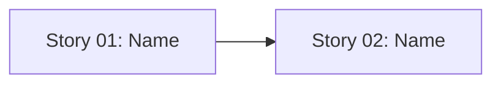

# 🚀 EXPANSION: [Planning Name]

> **Status:** Expansion
> [← planning/README.md](../../README.md)

---

## Story Summary

| # | Story | SDLC Phase(s) | Depends On | Risk | External Issue | Status |
|---|-------|--------------|------------|------|----------------|--------|
| 01 | [story name] | [D / R / S / …] | — | M | — | TODO |
| 02 | [story name] | [D / R / S / …] | 01 | L | — | TODO |

---

## Dependency Map

---

## Impact per Repository Area

| Code | Area | Affected? | What changes |
|------|------|----------|-------------|
| DO | `docs/` | ☐ | — |
| WB | `web/` | ☐ | — |
| AP | `api/` | ☐ | — |
| AG | `agents/` | ☐ | — |
| IN | `infra/` | ☐ | — |
| W | `.planning/` | ☐ | — |

---

## Notes

*Add context, risks, or cross-cutting concerns here.*

---

## Risk Register

| ID | Risk | Impact | Likelihood | Mitigation | Owner | Status |
|----|------|--------|------------|------------|-------|--------|
| R-01 | [What could make this planning fail?] | M | M | [Prevention or fallback] | [Owner] | Open |

Use `L`, `M`, or `H` for impact and likelihood. Carry high risks into the related story and task files.

---

## External Issue Mapping

| Story | External System | External ID / URL | Sync Notes |
|-------|-----------------|-------------------|------------|
| 01 | — | — | — |

---

> [← planning/README.md](../../README.md)
